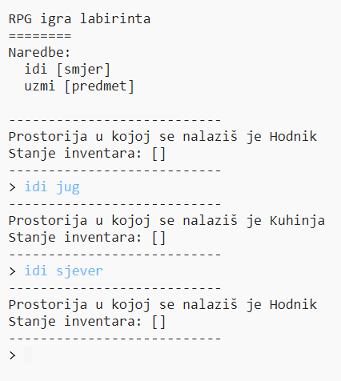
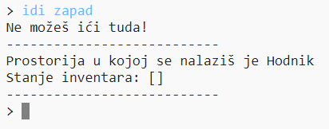
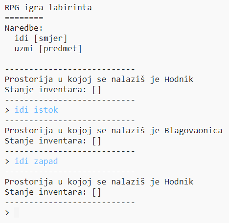

## Dodavanje novih prostorija

--- task --- Otvorite Python startni projekt.

**Online:** otvori početni projekt s [https://trinket.io/python/24b61dcd85](https://trinket.io/python/24b61dcd85){:target="_blank"}.

**Offline**: open the [početni projekt](http://rpf.io/p/hr-HR/rpg-go){:target="_blank"} u offline editoru. --- /task ---

--- task --- Ovo je vrlo jednostavna RPG igra koja se sastoji od samo dvije prostorije. Ispod se nalazi nacrt igre:

Upiši `idi jug` za pomicanje iz hodnika u kuhinju, a zatim `idi sjever` za povratak u hodnik!

 --- /task ---

--- task --- Što se dogodi kada upišeš smjer u kojem ne možeš ići? Upiši `idi zapad` dok si u hodniku i dobit ćeš simpatičnu poruku o grešci.

 --- /task ---

--- task --- Pronađi varijablu `prostorije` i vidjet ćeš da je nacrt kodiran u obliku rječnika prostorija:

--- code ---
---
## language: python
---
# rječnik koji povezuje prostorije jednu s drugom

prostorije = {

            'Hall' : {
                'south' : 'Kitchen'
            },
    
            'Kitchen' : {
                'north' : 'Hall'
            }
    
        }
    

--- /code ---

Svaka prostorija je jedan rječnik, a prostorije su međusobno povezane smjerovima.  
--- /task ---

--- task --- Dodajmo istočno od hodnika blagovaonicu.

Trebate dodati treću prostoriju, naziva `blagovaonica`, i vezu na hodnik (na zapad). Moraš dodati i podatke prostoriji hodnik u rječniku kako bi bilo moguće pomicati se u blagovaonicu na istoku.

**Ne zaboravite da morate dodati zareze na linije prije vašeg novog koda.**

--- code ---
---
language: python
---
## line_highlights: 5-6,11-15

# rječnik koji povezuje prostorije jednu s drugom

prostorije = {

            'Hall' : {
                'south' : 'Kitchen',
                'east' : 'Dining Room'
            },
    
            'Kitchen' : {
                'north' : 'Hall'
            },
    
            'Dining Room' : {
                'west' : 'Hall'
            }
    
        }
    

--- /code --- --- /task ---

--- task --- Isprobaj igru sad kad si dodao blagovaonicu:

Ako se ne možeš pomicati u blagovaonicu i iz nje, provjeri jesi li dodao sav kôd koji se nalazi iznad (uključujući i dodatne zareze u linijama). --- /task ---