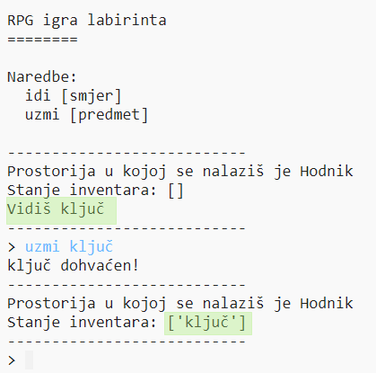

## Dodavanje predmeta za sakupljanje

U prostorije ćemo postaviti predmete koje će igrač sakupljati dok se bude kretao labirintom.

+ Dodavanje predmeta u prostoriju je lako - jednostavno ga dodaj u rječnik prostorije u kojoj želiš da se pojavi. Pokušajmo staviti ključ u hodnik.
    
    
    
    Ne zaboravi staviti zarez nakon linije iznad novog unosa ili program neće raditi!

+ Pokreneš li sada igru, vidjet ćeš ključ u hodniku kojeg možeš čak i pokupiti (upisivanjem `uzmi ključ`). Tako ćeš ga dodati u svoj inventar!
    
    