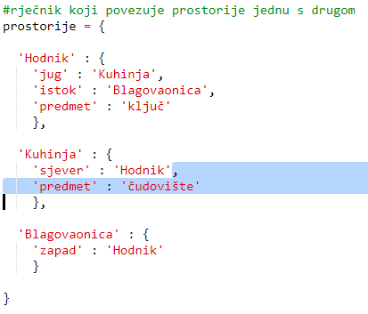
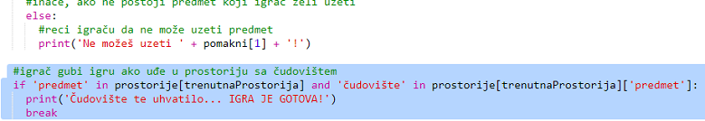
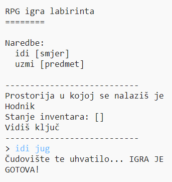

## Adding enemies

This game is too easy! Let’s add enemies to some rooms that the player must avoid.

+ Adding an enemy to a room is as easy as adding any other item. Let’s add a hungry monster to the kitchen:
    
    

+ You also want to make sure that the game ends if the player enters a room with a monster in. You can do this with the following code, which you should add to the end of the game:
    
    
    
    This code checks whether there is an item in the room, and if so, whether that item is a monster. Notice that this code is indented, putting it in line with the code above it. This means that the game will check for a monster every time the player moves into a new room.

+ Test out your code by going into the kitchen, which now contains a monster.
    
    