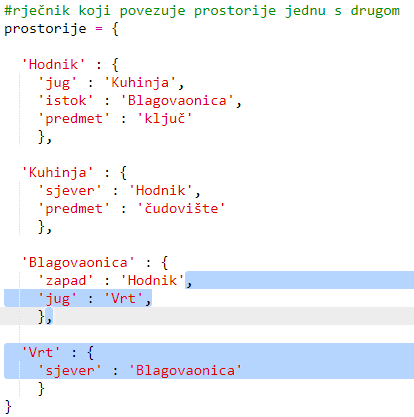
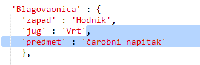
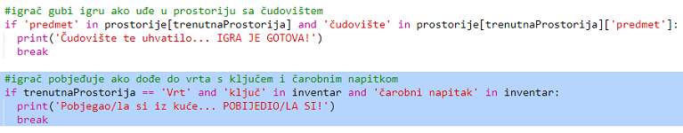
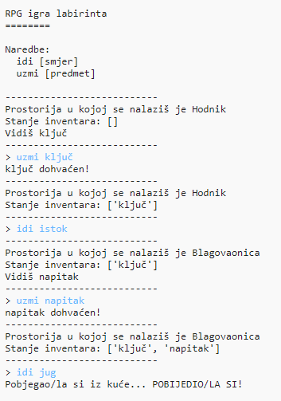
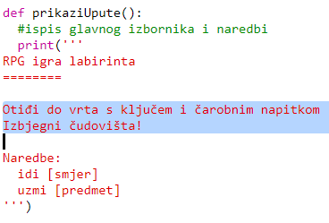
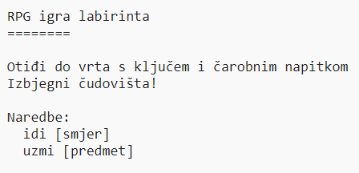

## Pobjeda u igri

Dajmo tvom igraču nekakvu misiju koju mora izvršiti kako bi pobijedio u igri.

+ U ovoj će igri igrač pobijediti ako dođe do vrta i pobjegne iz kuće. Također sa sobom mora imati ključ i čarobni napitak. Ispod se nalazi nacrt igre.
    
    

+ Prvo moraš dodati vrt južno od blagovaonice. Ne zaboravi dodati i vrata kako bi vrt bio povezan s drugim prostorijama u kući.
    
    

+ Dodaj čarobni napitak u blagovaonicu (ili bilo koju drugu prostoriju u kući).
    
    

+ Dodaj sljedeći kôd kojim ćeš omogućiti igraču da bude pobjednik ako dođe do vrta sa ključem i čarobnim napitkom:
    
    
    
    Pobrini se da je kôd uvučen, odnosno u razini sa kôdom iznad njega. Ovaj kôd ispisat će poruku `Pobjegao/la si iz kuće...POBIJEDIO/LA SI!` ako se igrač nalazi u vrtu i u svom inventaru ima ključ i čarobni napitak.
    
    Ako tvoja kuća ima više od četiri prostorije, možda ćeš, u kôdu iznad, morati upisati drugi naziv prostorije.

+ Testiraj igru i provjeri može li tvoj igrač pobijediti!
    
    

+ Konačno, dodajmo upute za igru kako bi igrač znao što treba raditi. Izmijeni funkciju `prikaziUpute()` tako da sadrži više informacija.
    
    
    
    Dodaj upute koje govore igraču koje predmete treba sakupiti i što treba izbjegavati!

+ Testiraj igru i tvoje nove upute bi se trebale prikazati.
    
    