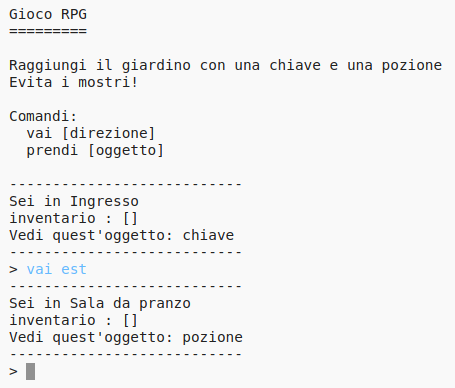

## Introduzione:

In quest'attività, progetterai e programmerai il tuo RPG (gioco di ruolo) a labirinti. Lo scopo del gioco sarà quello di raccogliere oggetti e fuggire da una casa, assicurandosi di evitare tutti i mostri!

## Che cosa creerai

\--- no-print \---

Digita `vai` e quindi una direzione (nord, esst, sud o ovest) per spostarti nel mondo (ad es. `vai nord`).

Digita `prendi` per raccogliere tutti gli elementi che vedi (esempio `prendi chiave`).

  <iframe src="https://trinket.io/embed/python/d06adeb527?outputOnly=true&start=result" width="600" height="500" frameborder="0" marginwidth="0" marginheight="0" allowfullscreen>
  </iframe>
  

\--- /no-print \---

\--- print-only \---

\--- /print-only \---

## \--- collapse \---

## title: What you will need

### Hardware

+ Un computer in grado di eseguire Python

### Software

+ Python 3 ([online](https://trinket.io/){:target="_blank"} o [offline](https://www.python.org/downloads/){:target="_blank"}"})

### Downloads

The starter project can be found [here](http://rpf.io/p/en/rpg-go){:target="_blank"}.

\--- /collapse \---

## \--- collapse \---

## title: What you will learn

+ Progettazione di un gioco;
+ Sviluppo: 
    + Liste;
    + Dizionari.
+ Espressioni booleane.

This project covers elements from the following strands of the [Raspberry Pi Digital Making Curriculum](http://rpf.io/curriculum):

+ [Combinare i costrutti base di un linguaggio di programmazione per risolvere un problema.](https://www.raspberrypi.org/curriculum/programming/builder)

\--- /collapse \---

## \--- collapse \---

## title: Additional information for educators

If you need to print this project, please use the [Printer friendly version](https://projects.raspberrypi.org/en/projects/rpg/print).

You can [find the solution for this project here](http://rpf.io/p/en/rpg-get){:target="_blank"}.

\--- /collapse \---