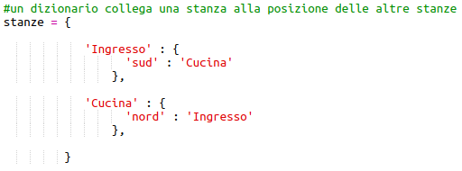
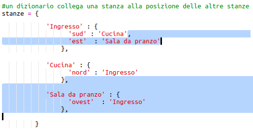

## Aggiungere nuove stanze

+ Abbiamo già preparato per te una parte del codice per questo gioco. Apri questo trinket: <a href="http://jumpto.cc/rpg-go" target="_blank">jumpto.cc/rpg-go</a>.

+ Questo è un gioco RPG molto semplice che ha solo 2 stanze. Ecco la mappa del gioco:
    
    
    
    Puoi digitare `vai sud`per spostarti dalla sala alla cucina, e poi `vai nord` per tornare di nuovo all'ingresso!
    
    

+ Cosa succede quando digiti una direzione che non puoi seguire? Digita `vai ovest`nell'ingresso e riceverai un messaggio di errore.
    
    

+ Se cerchi la variabile `camere`, puoi vedere che la mappa è codificata come un dizionario di stanze:
    
    
    
    Ogni stanza è un dizionario e le stanze sono collegate tra loro usando le direzioni.

+ Aggiungiamo una sala da pranzo alla tua mappa, ad est dell'ingresso.
    
    
    
    Devi aggiungere una terza stanza, chiamata `sala da pranzo`. Devi anche collegarla all'ingresso ad ovest. Devi anche aggiungere dati all'ingresso, in modo da poterti spostare nella sala da pranzo ad est.
    
    

+ Prova il gioco con la tua nuova sala da pranzo:
    
    
    
    Se non riesci ad entrare e uscire dalla sala da pranzo, controlla di aver aggiunto tutto il codice sopra riportato (comprese le virgole extra alle righe sopra).