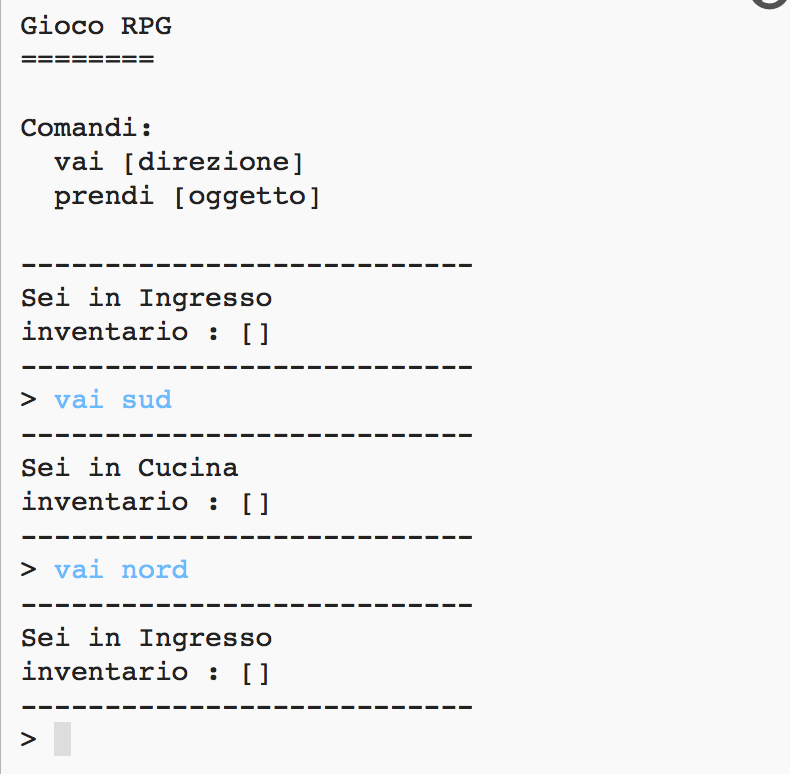
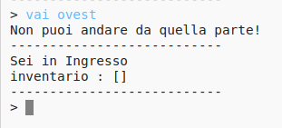

## Aggiungere nuove stanze

\--- task \---

Apri il progetto iniziale.

**Online:** apri il progetto iniziale su [rpf.io/rpgon](http://rpf.io/rpgon){:target="_blank"}.

**Offline:** apri il [progetto iniziale ](http://rpf.io/p/en/rpg-go){:target="_blank"} nell'editor offline.

\--- /task \---

\--- task \---

Questo è un gioco RPG molto semplice che ha solo 2 stanze. Ecco la mappa del gioco:

Puoi digitare `vai sud`per spostarti dalla sala alla cucina, e poi `vai nord` per tornare di nuovo all'ingresso!

\--- /task \---

\--- task \---

Cosa succede quando digiti una direzione che non puoi seguire? Digita `vai ovest`nell'ingresso e riceverai un messaggio di errore.

\--- /task \---

\--- task \---

Se cerchi la variabile `camere`, puoi vedere che la mappa è codificata come un dizionario di stanze:

## \--- code \---

## language: python

# un dizionario collega una stanza alle altre

stanze = {

            'Ingresso' : {
                'sud' : 'Cucina'
            },
    
            'Cucina' : {
                'nord' : 'Ingresso'
            }
    
        }
    

\--- /code \---

Ogni stanza è un dizionario e le stanze sono collegate tra loro usando le direzioni.

\--- /task \---

\--- task \---

Aggiungiamo una sala da pranzo alla tua mappa, ad est dell'ingresso.

Devi aggiungere una terza stanza, chiamata `sala da pranzo`, e collegarla alla sala (ovest). Devi anche aggiungere dati all'ingresso, in modo da poterti spostare nella sala da pranzo ad est.

**Non dimenticare che dovrai anche aggiungere delle virgole prima del tuo nuovo codice.**

## \--- code \---

language: python

## line_highlights: 5-6,11-15

# un dizionario collega una stanza alle altre

stanze = {

            'Hall' : {
                'sud' : 'Cucina',
                'est' : 'Sala da Pranzo'
            },
    
            'Cucina' : {
                'nord' : 'Ingresso'
            },
    
            'Sala da Pranzo' : {
                'ovest' : 'Ingresso'
            }
    
        }
    

\--- /code \---

\--- /task \---

\--- task \---

Prova il gioco con la tua nuova sala da pranzo:

Se non riesci ad entrare e uscire dalla sala da pranzo, controlla di aver aggiunto tutto il codice sopra riportato (comprese le virgole extra alle righe sopra).

\--- /task \---