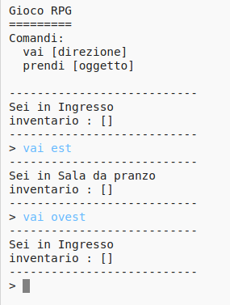

## Aggiungere nuove stanze

+ Alcuni codici di questo gioco sono stati forniti. Scrivi questo trinket: <a href="http://jumpto.cc/rpg-go" target="_blank">jumpto.cc/rpg-go</a>.

+ Questo è un gioco RPG molto basico, dove ci sono solo 2 stanze. Ecco una mappa del gioco:

  

  Puoi digitare 'go south' per muoverti dall'ingresso alla cucina, e poi 'go north' per tornare di nuovo all'ingresso!

  

+ Cosa succede quando digiti una direzione verso la quale non puoi andare? Digita 'go west' nell'ingresso e otterrai un amichevole messaggio di errore.

  

+ Se trovi la variabile 'rooms', puoi vedere che la mappa è codificata come un dizionario di stanze:

  

  Ogni stanza è un dizionario e le stanze sono collegate tra di loro usando le direzioni.  

+ Aggiungiamo alla tua mappa una stanza da pranzo, a est dell'ingresso.

  

  Hai bisogno di una terza stanza, denominata 'dining room'. Dovrai anche collegarla all'ingresso a ovest. Avrai anche bisogno di aggiungere dati all'ingresso, in modo che tu possa muoverti verso la stanza da pranzo a est.

  

+ Prova il gioco con la tua nuova stanza da pranzo.

  

  Non puoi entrare ed uscire dalla stanza da pranzo, semplicemente controlla di aver aggiunto tutti i codici qui sopra (incluse le virgole aggiuntive alle linee di sopra).
