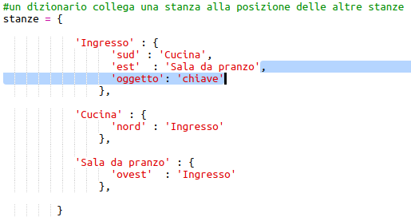
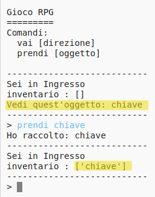

## Aggiungere oggetti da raccogliere

Lascia gli oggetti nelle stanze in modo che il giocatore possa raccoglierli mentre si sposta attraverso il labirinto.

+ Aggiungere un oggetto in una stanza è facile, basta aggiungerlo al dizionario di una stanza. Mettiamo una chiave nell'ingresso.
    
    
    
    Ricorda di mettere una virgola dopo la riga sopra il nuovo oggetto, altrimenti il tuo programma non funzionerà!

+ Se esegui il gioco dopo aver aggiunto il codice sopra, ora puoi vedere una chiave nell'ingresso e puoi persino raccoglierla (digitando `prendi la chiave`) aggiungendola al tuo inventario!
    
    