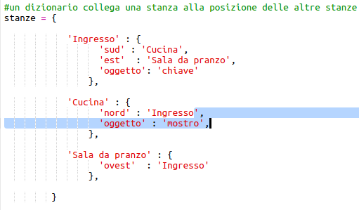
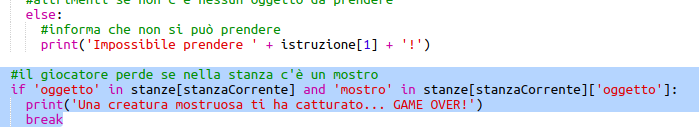

## Aggiungere nemici

Questo gioco è troppo facile! Aggiungiamo ad alcune stanze dei nemici che il giocatore deve evitare.

+ Aggiungere un nemico a una stanza è facile come gli altri oggetti. Aggiungiamo alla cucina un mostro affamato:

  

+ Assicurati anche che il gioco finisca se il giocatore entra in una delle stanze dove si trova il mostro. Puoi fare ciò con il seguente codice, che dovresti aggiungere alla fine del gioco:

  

  Questo codice controlla se c'è un oggetto nella stanza, e se c'è, se quell'oggetto è un mostro. Nota che questo codice è indentato, collocandolo in linea con il codice di sopra. Questo significa che il gioco controllerà la presenza di un mostro ogni volta che il giocatore si sposta in una nuova stanza.

+ Prova il tuo codice andando in cucina, dove adesso si trova un mostro.

  

