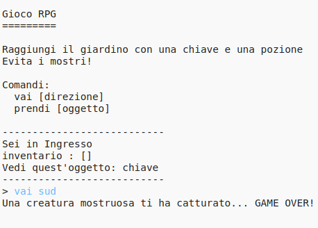

## Aggiungere nemici

Il gioco è troppo semplice! Aggiungiamo in alcune stanze nemici da evitare.

\--- task \---

Adding an enemy to a room is as easy as adding any other item. Let’s add a hungry monster to the kitchen:

## \--- code \---

language: python

## line_highlights: 11-12

# un dizionario collega una stanza alle altre

rooms = {

            'Ingresso' : {
                'sud' : 'Cucina',
                'est' : 'Sala da Pranzo'
            },
    
            'Cucina' : {
                'nord' : 'Ingresso'
            },
    
            'Sala da Pranzo' : {
                'ovest' : 'Ingresso'
            }
    
        }
    

\--- /code \---

\--- /task \---

\--- task \---

You also want to make sure that the game ends if the player enters a room with a monster in. You can do this with the following code, which you should add to the end of the game:

## \--- code \---

language: python

## line_highlights: 6-9

        #altrimenti, se l'oggetto non c'è
        else:
            #informa che non possono prenderlo
            print('Impossibile prendere ' + istruzione[1] + '!')
    
    #il giocatore perde se entra in una stanza con un mostro
    if 'item' in rooms[currentRoom] and 'monster' in rooms[currentRoom]['item']:
        print('Un mostro ti ha catturato... HAI PERSO!')
        break
    

\--- /code \---

This code checks whether there is an item in the room, and if so, whether that item is a monster. Notice that this code is indented, putting it in line with the code above it. This means that the game will check for a monster every time the player moves into a new room.

\--- /task \---

\--- task \---

Test out your code by going into the kitchen, which now contains a monster.

\--- /task \---