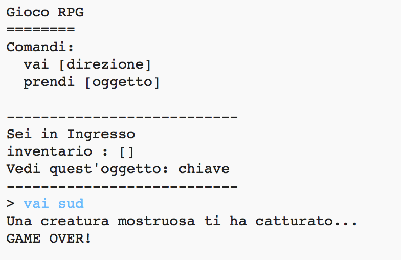

## Aggiungere nemici

Il gioco è troppo semplice! Aggiungiamo in alcune stanze nemici da evitare.

\--- task \--- Adding an enemy to a room is as easy as adding any other item. Aggiungi un mostro affamato in cucina:

## \--- code \---

language: python

## line_highlights: 11-12

# un dizionario collega una stanza alle altre

stanze = {

            'Hall' : {
                'south' : 'Kitchen',
                'east' : 'Dining Room',
                'item' : 'key'
            },
    
            'Kitchen' : {
                'north' : 'Hall',
                'item' : 'monster'
            },
    
            'Dining Room' : {
                'west' : 'Hall'
            }
    
        }
    

\--- /code \--- \--- /task \---

\--- task \--- You also want to make sure that the game ends if the player enters a room with a monster in. Puoi farlo con il seguente codice, che dovresti aggiungere alla fine del gioco:

## \--- code \---

language: python

## line_highlights: 6-9

        #otherwise, if the item isn't there to get
        else:
            #tell them they can't get it
            print('Can\'t get' + move[1] + '!')
    
    #player loses if they enter a room with a monster
    if 'item' in rooms[currentRoom] and 'monster' in rooms[currentRoom]['item']:
        print('A monster has got you... GAME OVER!')
        break
    

\--- /code \---

Questo codice controlla se c'è un oggetto nella stanza, e in tal caso, se quell'oggetto è un mostro. Nota che questo codice è indentato in modo da allinearlo con la linea di codice precedente. Di conseguenza il gioco controllerà la presenza di un mostro ogni volta che il giocatore si trasferisce in una nuova stanza. \--- /task \---

\--- task \--- Test out your code by going into the kitchen, which now contains a monster.

 \--- /task \---