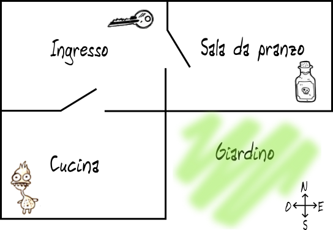
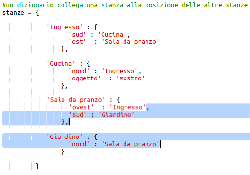
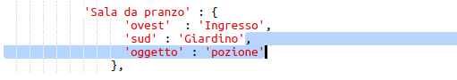
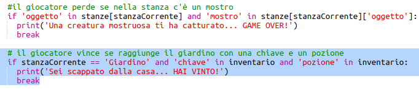
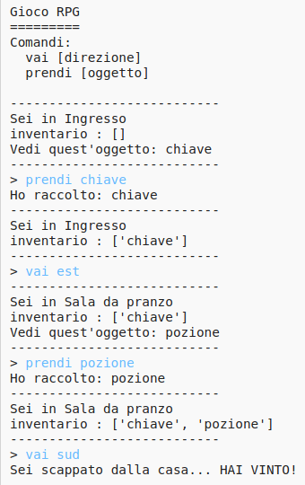
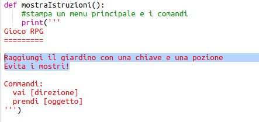
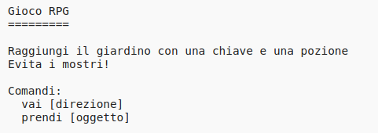

## Vincere il gioco

Diamo al tuo giocatore una missione che deve essere completata per vincere la partita.

+ In questo gioco il giocatore vince arrivando in giardino e fuggendo dalla casa. Deve anche avere con sè la chiave e la pozione magica. Ecco la mappa del gioco.
    
    

+ Per cominciare aggiungi un giardino a sud della sala da pranzo. Ricorda di aggiungere porte per collegarti ad altre stanze della casa.
    
    

+ Aggiungi una pozione in sala da pranzo (o in un'altra stanza della tua casa).
    
    

+ Aggiungi questo codice per consentire al giocatore di vincere la partita quando arriva in giardino con la chiave e la pozione:
    
    
    
    Assicurati che il codice sia indentato, allineato col codice che lo precede. Questo codice significa che il messaggio `Sei fuggito dalla casa... HAI VINTO!` VERRÀ visualizzato se il giocatore si trova nella stanza 4 (il giardino) e se la chiave e la pozione sono nell'inventario.
    
    Se hai più di 4 camere, potresti dover utilizzare un numero di stanza diverso per il tuo giardino nel codice qui sopra.

+ Prova il tuo gioco per assicurarti che il giocatore possa vincere!
    
    

+ Infine aggiungi alcune istruzioni al gioco, in modo che il giocatore sappia cosa deve fare. Modifica la funzione `mostraIstruzioni()` per includere più informazioni.
    
    
    
    Dovrai aggiungere istruzioni per dire all'utente quali oggetti devono raccogliere e cosa devono evitare!

+ Prova il tuo gioco e dovresti vedere le tue nuove istruzioni.
    
    