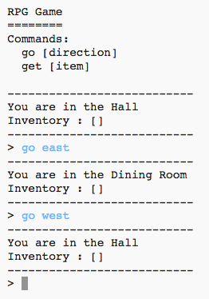

## 新しい部屋を追加する

+ このゲームのいくつかのコードはあなたのために提供されています。 Trinketをひらく: <a href="http://jumpto.cc/rpg-go" target="_blank">jumpto.cc/rpg-go</a>.

+ これは2つの部屋しか持たない非常に基本的なRPGゲームです。 ゲームの地図はここにあります：
    
    
    
    あなたは `を入力してホール` からキッチンに移動し、 `を北` に移動して再びホールに戻ることができます。
    
    

+ あなたが行けない方向にタイプするとどうなりますか？ タイプ `は、ホールの西` に行きます。フレンドリーなエラーメッセージが表示されます。
    
    

+ `部屋` 変数を見つけると、その地図が部屋の辞書としてコード化されていることがわかります。
    
    
    
    各部屋は辞書であり、部屋は方向を使用してリンクされています。

+ 会場の東に、あなたの地図にダイニングルームを追加しましょう。
    
    
    
    `ダイニングルーム`と呼ばれる3番目の部屋を追加する必要があります。 あなたはまた、西へのホールにそれをリンクする必要があります。 また、ホールにデータを追加する必要があるため、ダイニングルームを東に移動できます。
    
    

+ あなたの新しいダイニングルームで試してみてください：
    
    
    
    ダイニングルームに出入りすることができない場合は、上記のコードをすべて追加したことを確認してください（上の行に余分なカンマを含む）。