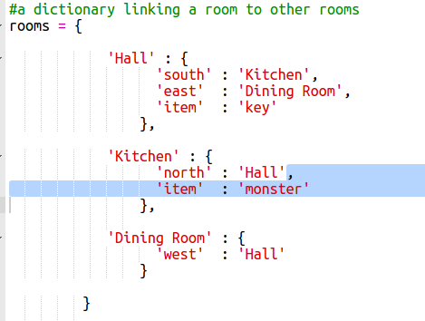

## 敵を追加する

このゲームはあまりにも簡単です！ プレイヤーが避けなければならない部屋に敵を追加しましょう。

+ 部屋に敵を追加するのは、他のアイテムを追加するのと同じくらい簡単です。 空腹のモンスターを台所に追加しましょう：
    
    

+ また、プレイヤーがモンスターの入った部屋に入った場合にゲームが終了するようにしたいとします。 あなたはゲームの最後に追加する必要があります次のコードでこれを行うことができます：
    
    
    
    このコードでは、部屋にアイテムがあるかどうかを確認し、存在する場合はそのアイテムがモンスターであるかどうかをチェックします。 このコードはインデントされており、上のコードと一直線に並んでいます。 これは、プレイヤーが新しい部屋に移動するたびにゲームがモンスターをチェックすることを意味します。

+ あなたのコードをテストするには、モンスターが含まれている台所に行ってください。
    
    