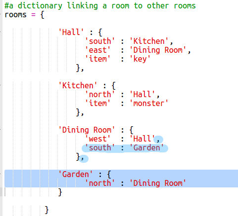
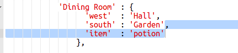

## ゲームに勝つ

ゲームに勝つために完了する必要があるミッションをプレイヤーに与えましょう。

+ このゲームでは、プレイヤーは庭に出て家を逃れることで勝ちます。 彼らはまた、それらとキーと魔法の薬を持っている必要があります。 ここにゲームの地図があります。
    
    

+ まず、ダイニングルームの南に庭を追加する必要があります。 ドアを追加して、家の他の部屋にリンクすることを忘れないでください。
    
    

+ ダイニングルーム（またはあなたの家の別の部屋）にポーションを追加します。
    
    

+ このコードを追加すると、キーと薬で庭に行くときにプレイヤーがゲームに勝つことができます：
    
    
    
    上記のコードに沿って、このコードがインデントされていることを確認してください。 このコードは、メッセージ `あなたが家をエスケープしたことを意味します...あなたが勝つ！プレイヤーが部屋4（庭園）にいて、キーとポーションがインベントリにある場合は、` が表示されます。
    
    4つ以上の部屋がある場合は、上記のコードであなたの庭に異なる部屋番号を使用する必要があります。

+ あなたのゲームを試して、プレーヤーが勝つことができることを確認してください！
    
    

+ 最後に、あなたのゲームにいくつかの指示を加えて、プレイヤーが自分が何をしなければならないかを知りましょう。 `showInstructions（）` 関数を編集して、より多くの情報を追加します。
    
    
    
    収集する必要があるアイテムと回避する必要があるものをユーザーに伝えるための指示を追加する必要があります。

+ ゲームを試してみると、新しい指示が表示されます。
    
    