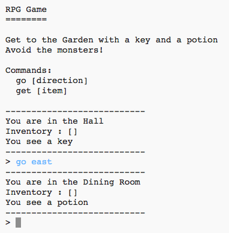

## ಪರಿಚಯ:

ಈ ಯೋಜನೆಯಲ್ಲಿ, ನಿಮ್ಮ ಸ್ವಂತ RPG ಜಟಿಲ ಆಟವನ್ನು ನೀವು ವಿನ್ಯಾಸಗೊಳಿಸುತ್ತೀರಿ ಮತ್ತು ಕೋಡ್ ಮಾಡುತ್ತೀರಿ. ಎಲ್ಲಾ ರಾಕ್ಷಸರನ್ನು ತಪ್ಪಿಸುವುದನ್ನು ಖಚಿತಪಡಿಸಿಕೊಳ್ಳುವ ಮೂಲಕ ವಸ್ತುಗಳನ್ನು ಸಂಗ್ರಹಿಸಿ ಮನೆಯಿಂದ ತಪ್ಪಿಸಿಕೊಳ್ಳುವುದು ಆಟದ ಉದ್ದೇಶವಾಗಿರುತ್ತದೆ!

## ನೀವು ಏನು ಮಾಡುತ್ತೀರಿ

\--- no-print \---

`go` ಎಂದು ಟೈಪ್ ಮಾಡಿ ತದನಂತರ ಪ್ರಪಂಚದಾದ್ಯಂತ ಚಲಿಸುವ ದಿಕ್ಕು(north,east,south or west) (ಉದಾ. `go north`).

ನೀವು ನೋಡುವ ಯಾವುದೇ ವಸ್ತುಗಳನ್ನು ತೆಗೆದುಕೊಳ್ಳಲು `get` ಎಂದು ಟೈಪ್ ಮಾಡಿ (ಉದಾ. `get key`).

  <iframe src="https://trinket.io/embed/python/d06adeb527?outputOnly=true&start=result" width="600" height="500" frameborder="0" marginwidth="0" marginheight="0" allowfullscreen>
  </iframe>
  

\--- /no-print \---

\--- print-only \---

\--- /print-only \---

## \--- collapse \---

## title: ನಿಮಗೆ ಬೇಕಾದುದು

### ಯಂತ್ರ

+ ಪೈಥಾನ್ ಅನ್ನು ಚಲಾಯಿಸುವ ಸಾಮರ್ಥ್ಯವಿರುವ ಕಂಪ್ಯೂಟರ್

### ಸಾಫ್ಟ್ವೇರ್

+ Python 3 (ಎರಡೂ [online](https://trinket.io/){:target="_blank"} ಅಥವಾ [offline](https://www.python.org/downloads/){:target="_blank"})

### ಡೌನ್‌ಲೋಡ್‌ಗಳು

ಸ್ಟಾರ್ಟರ್ ಯೋಜನೆಯನ್ನು ಇಲ್ಲಿ ಕಾಣಬಹುದು [here](http://rpf.io/p/en/rpg-go) {:target="_blank"}.

\--- /collapse \---

## \--- collapse \---

## title: ನೀವು ಏನು ಕಲಿಯುವಿರಿ

+ ಆಟದ ವಿನ್ಯಾಸ;
+ ಸಂಪಾದನೆ: 
    + ಪಟ್ಟಿಗಳು;
    + ನಿಘಂಟುಗಳು.
+ ಬೂಲಿಯನ್ ಅಭಿವ್ಯಕ್ತಿಗಳು.

ಈ ಯೋಜನೆಯು ಕೆಳಗಿನ [Raspberry Pi Digital Making Curriculum](http://rpf.io/curriculum) ಎಳೆಗಳಿಂದ ಅಂಶಗಳನ್ನು ಒಳಗೊಂಡಿದೆ:

+ [ಸಮಸ್ಯೆಯನ್ನು ಪರಿಹರಿಸಲು ಪ್ರೋಗ್ರಾಮಿಂಗ್ ರಚನೆಗಳನ್ನು ಸಂಯೋಜಿಸಿ.](https://www.raspberrypi.org/curriculum/programming/builder)

\--- /collapse \---

## \--- collapse \---

## title: ಶಿಕ್ಷಕರಿಗೆ ಹೆಚ್ಚುವರಿ ಮಾಹಿತಿ

ನೀವು ಈ ಯೋಜನೆಯನ್ನು ಮುದ್ರಿಸಬೇಕಾದರೆ, ದಯವಿಟ್ಟು [ಮುದ್ರಕ-ಸ್ನೇಹಿ ಆವೃತ್ತಿಯನ್ನು ಬಳಸಿ](https://projects.raspberrypi.org/en/projects/rpg/print).

ನೀವು ಯೋಜನೆಯ ಪರಿಹಾರವನ್ನು ಇಲ್ಲಿ ಪಡೆಯ ಬಹುದು [find the solution for this project here](http://rpf.io/p/en/rpg-get){:target="_blank"}.

\--- /collapse \---