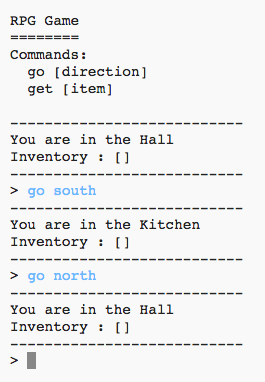
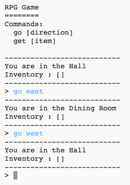

## ಹೊಸ ಕೊಠಡಿಗಳನ್ನು ಸೇರಿಸಲಾಗುತ್ತಿದೆ

\--- task \---

ಪೈಥಾನ್ ಸ್ಟಾರ್ಟರ್ ಯೋಜನೆಯನ್ನು ತೆರೆಯಿರಿ.

**Online**: ಸ್ಟಾರ್ಟರ್ ಯೋಜನೆಯನ್ನು [rpf.io/rpgon](http://rpf.io/rpgon){:target="_blank"} ನಲ್ಲಿ ತೆರೆಯಿರಿ.

**Offline**: open the [starter project](http://rpf.io/p/en/rpg-go){:target="_blank"} in the offline editor.

\--- /task \---

\--- task \---

ಇದು ಕೇವಲ 2 ಕೊಠಡಿಗಳನ್ನು ಹೊಂದಿರುವ ಅತ್ಯಂತ ಮೂಲಭೂತ RPG ಆಟವಾಗಿದೆ. ಆಟದ ನಕ್ಷೆ ಇಲ್ಲಿದೆ:

ನೀವು hall ದಿಂದ kitchen ಗೆ ಹೋಗಲು `go south` ಟೈಪ್ ಮಾಡಬಹುದು, ತದನಂತರ `go north` ಟೈಪ್ ಮಾಡಿ ಮತ್ತೆ hall ಗೆ ಹೋಗಬಹುದು!

\--- /task \---

\--- task \---

ನೀವು ಹೋಗಲು ಸಾಧ್ಯವಾಗದ ದಿಕ್ಕಿನಲ್ಲಿ ಟೈಪ್ ಮಾಡಿದಾಗ ಏನಾಗುತ್ತದೆ? Hall ನಲ್ಲಿ`go west` ಎಂದು ಟೈಪ್ ಮಾಡಿದಂತೆ, ನೀವು ಸ್ನೇಹಪರ ದೋಷ ಸಂದೇಶವನ್ನು ಪಡೆಯುತ್ತೀರಿ.

\--- /task \---

\--- task \---

ನೀವು `rooms`ವೇರಿಯಬಲ್ ಕಂಡುಕೊಂಡರೆ, ನಕ್ಷೆಯನ್ನು ಕೋಣೆಗಳ ನಿಘಂಟಾಗಿ ಸಂಕೇತಗೊಳಿಸಲಾಗಿದೆ ಎಂದು ನೀವು ನೋಡಬಹುದು:

## \--- code \---

## language: python

# ಕೊಠಡಿಯನ್ನು ಇತರ ಕೋಣೆಗಳಿಗೆ ಜೋಡಿಸುವ ನಿಘಂಟು

rooms = {

            'Hall' : {
                'south' : 'Kitchen'
            },
    
            'Kitchen' : {
                'north' : 'Hall'
            }
    
        }
    

\--- /code \---

ಪ್ರತಿಯೊಂದು ಕೋಣೆಯೂ ನಿಘಂಟಾಗಿದ್ದು, ನಿರ್ದೇಶನಗಳನ್ನು ಬಳಸಿಕೊಂಡು ಕೊಠಡಿಗಳನ್ನು ಒಟ್ಟಿಗೆ ಜೋಡಿಸಲಾಗಿದೆ.

\--- /task \---

\--- task \---

ನಿಮ್ಮ ನಕ್ಷೆಗೆ ಒಂದು dining room ಅನ್ನು hallಇನಾ eastಕ್ಕೆ ಸೇರಿಸೋಣ.

ನೀವು 3 ನೇ ಕೋಣೆಯನ್ನು ಸೇರಿಸಬೇಕಾಗಿದೆ, ಇದನ್ನು `dining room` ಎಂದು ಕರೆಯಲಾಗುತ್ತದೆ, ಮತ್ತು ಅದನ್ನು hall ಇಗೆ (west ಿನ ಕಡೆ) ಲಿಂಕ್ ಮಾಡಿ. ನೀವು ಸಭಾಂಗಣಕ್ಕೆ ಡೇಟಾವನ್ನು ಕೂಡ ಸೇರಿಸಬೇಕಾಗಿದೆ, ಇದರಿಂದ ನೀವು ಪೂರ್ವಕ್ಕೆ room ಟದ ಕೋಣೆಗೆ ಹೋಗಬಹುದು.

**ನಿಮ್ಮ ಹೊಸ ಕೋಡ್‌ಗೆ ಮೊದಲು ನೀವು ಅಲ್ಪವಿರಾಮಗಳನ್ನು ಸಾಲುಗಳಿಗೆ ಸೇರಿಸಬೇಕಾಗುತ್ತದೆ ಎಂಬುದನ್ನು ಮರೆಯಬೇಡಿ.**

## \--- code \---

language: python

## line_highlights: 5-6,11-15

# ಕೊಠಡಿಯನ್ನು ಇತರ ಕೋಣೆಗಳಿಗೆ ಜೋಡಿಸುವ ನಿಘಂಟು

rooms = {

            'Hall' : {
                'south' : 'Kitchen',
                'east' : 'Dining Room'
            },
    
            'Kitchen' : {
                'north' : 'Hall'
            },
    
            'Dining Room' : {
                'west' : 'Hall'
            }
    
        }
    

\--- /code \---

\--- /task \---

\--- task \---

ನಿಮ್ಮ ಹೊಸ dining room ಯೊಂದಿಗೆ ಆಟವನ್ನು ಪ್ರಯತ್ನಿಸಿ:

ನಿಮಗೆ dining room ಇನಿಂದ ಒಳಗೆ ಮತ್ತು ಹೊರಗೆ ಹೋಗಲು ಸಾಧ್ಯವಾಗದಿದ್ದರೆ, ನೀವು ಮೇಲಿನ ಎಲ್ಲಾ ಕೋಡ್‌ಗಳನ್ನು ಸೇರಿಸಿದ್ದೀರಾ ಎಂದು ಪರಿಶೀಲಿಸಿ (ಮೇಲಿನ ಸಾಲುಗಳಿಗೆ ಹೆಚ್ಚುವರಿ ಅಲ್ಪವಿರಾಮಗಳನ್ನು ಒಳಗೊಂಡಂತೆ).

\--- /task \---