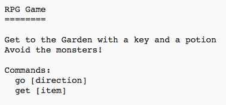

## ಆಟವನ್ನು ಗೆಲ್ಲುವುದು

ನಿಮ್ಮ ಆಟಗಾರನಿಗೆ ಗುರಿ ನೀಡೋಣ, ಅದು ಪಂದ್ಯವನ್ನು ಗೆಲ್ಲಲು ಪೂರ್ಣಗೊಳಿಸಬೇಕಾಗಿದೆ.

--- task ---

ಈ ಆಟದಲ್ಲಿ, ಆಟಗಾರನು gardenಇಗೆ ಬಂದು ಮನೆಯಿಂದ ತಪ್ಪಿಸಿಕೊಳ್ಳುವ ಮೂಲಕ ಗೆಲ್ಲುತ್ತಾನೆ. ಅವರು ಅವರೊಂದಿಗೆ keyಲಿಯನ್ನು ಮತ್ತು ಮ್ಯಾಜಿಕ್ potion ಹೊಂದಿರಬೇಕು. ಆಟದ ನಕ್ಷೆ ಇಲ್ಲಿದೆ.

--- /task ---

--- task ---

ಮೊದಲಿಗೆ, ನೀವು ಕೊಠಡಿ ಟದ ಕೋಣೆಯ ದಕ್ಷಿಣಕ್ಕೆ ಉದ್ಯಾನವನ್ನು ಸೇರಿಸುವ ಅಗತ್ಯವಿದೆ. ಮನೆಯ ಇತರ ಕೊಠಡಿಗಳಿಗೆ ಲಿಂಕ್ ಮಾಡಲು, ಬಾಗಿಲುಗಳನ್ನು ಸೇರಿಸಲು ಮರೆಯದಿರಿ.

--- code ---
---
language: python
line_highlights: 16-17,18-22
---
# ಕೊಠಡಿಯನ್ನು ಇತರ ಕೊಠಡಿಗಳಿಗೆ ಜೋಡಿಸುವ ನಿಘಂಟು
rooms = {

            'Hall' : {
                'south' : 'Kitchen',
                'east' : 'Dining Room',
                'item' : 'key'
            },

            'Kitchen' : {
                'north' : 'Hall',
                'item' : 'monster'
            },

            'Dining Room' : {
                'west' : 'Hall',
                'south' : 'Garden'
            },

            'Garden' : {
                'north' : 'Dining Room'
            }

        }
        
--- /code ---

--- /task ---

--- task ---

Dining room ಇಗೆ ಒಂದು potion ಸೇರಿಸಿ (ಅಥವಾ ನಿಮ್ಮ ಮನೆಯಲ್ಲಿ ಇನ್ನೊಂದು ಕೊಠಡಿ ಸೇರಿಸಿ).

--- code ---
---
language: python
---
line_highlights: 3-4
            'Dining Room' : {
                'west' : 'Hall',
                'south' : 'Garden',
                'item' : 'potion'
            },
--- /code ---

--- /task ---

--- task ---

key ಮತ್ತು potionಗಳೊಂದಿಗೆ garden ಇಗೆ ಬಂದಾಗ ಆಟಗಾರನು ಪಂದ್ಯವನ್ನು ಗೆಲ್ಲಲು ಈ ಕೋಡ್ ಅನ್ನು ಸೇರಿಸಿ:

--- code ---
---
language: python
line_highlights: 6-9
---
# ಆಟಗಾರನು monster ಇರುವ ಕೊಠಡಿಗೆ ಪ್ರವೇಶಿಸಿದರೆ ಸೋತುಹೋಗುತ್ತಾನೆ
if 'item' in rooms[currentRoom] and 'monster' in rooms[currentRoom]['item']:
    print('A monster has got you... GAME OVER!')
    break

# ಆಟಗಾರನು ಗೆಲ್ಲುತ್ತಾನೆ ಅವರೇನಾದರು key ಮತ್ತು potionಗಳೊಂದಿಗೆ ಉದ್ಯಾನಕ್ಕೆ ಹೋಗಿದ್ದೇರೆ
if currentRoom == 'Garden' and 'key' in inventory and 'potion' in inventory:
    print('You escaped the house... YOU WIN!')
    break

--- /code ---

ಈ ಕೋಡ್ ಅನ್ನು ಇಂಡೆಂಟ್ ಮಾಡಲಾಗಿದೆಯೆ ಎಂದು ಖಚಿತಪಡಿಸಿಕೊಳ್ಳಿ, ಅದರ ಮೇಲಿನ ಕೋಡ್‌ಗೆ ಅನುಗುಣವಾಗಿ. ಈ ಕೋಡ್ ಎಂದರೆ `You escaped the house...YOU WIN!` ಆಟಗಾರನು 4 ನೇ ಕೊಠಡಿಯಲ್ಲಿದ್ದರೆ (garden) ಮತ್ತು key ಮತ್ತು potion ದಾಸ್ತಾನುಗಳಲ್ಲಿದ್ದರೆ ಪ್ರದರ್ಶಿಸಲಾಗುತ್ತದೆ.

ನೀವು 4 ಕ್ಕಿಂತ ಹೆಚ್ಚು ಕೊಠಡಿಗಳನ್ನು ಹೊಂದಿದ್ದರೆ, ಮೇಲಿನ ಕೋಡ್‌ನಲ್ಲಿ ನಿಮ್ಮ garden ಈಗಾಗಿ ನೀವು ಬೇರೆ ಕೊಠಡಿಯ ಸಂಖ್ಯೆಯನ್ನು ಬಳಸಬೇಕಾಗಬಹುದು.

--- /task ---

--- task ---

ಆಟಗಾರನು ಗೆಲ್ಲಬಹುದೆಂದು ಖಚಿತಪಡಿಸಿಕೊಳ್ಳಲು ನಿಮ್ಮ ಆಟವನ್ನು ಪರೀಕ್ಷಿಸಿ!

--- /task ---

--- task ---

ಅಂತಿಮವಾಗಿ, ನಿಮ್ಮ ಆಟಕ್ಕೆ ಕೆಲವು ಸೂಚನೆಗಳನ್ನು ಸೇರಿಸೋಣ, ಇದರಿಂದ ಆಟಗಾರನಿಗೆ ಏನು ಮಾಡಬೇಕೆಂದು ತಿಳಿಯುತ್ತದೆ. ಹೆಚ್ಚಿನ ಮಾಹಿತಿಯನ್ನು ಸೇರಿಸಲು `showInstructions()` ಫುನ್ಕ್ಷನ್ ಅನ್ನು ಸಂಪಾದಿಸಿ.

--- code ---
---
language: python
line_highlights: 7-8
---
def showInstructions():
    #print a main menu and the commands
    print('''
RPG Game
========

Get to the Garden with a key and a potion
Avoid the monsters!

Commands:
go [direction]
get [item]
''')
--- /code ---

ಅವರು ಯಾವ ವಸ್ತುಗಳನ್ನು ಸಂಗ್ರಹಿಸಬೇಕು, ಮತ್ತು ಅವರು ತಪ್ಪಿಸಬೇಕಾದದ್ದನ್ನು ಬಳಕೆದಾರರಿಗೆ ತಿಳಿಸಲು ನೀವು ಸೂಚನೆಗಳನ್ನು ಸೇರಿಸುವ ಅಗತ್ಯವಿದೆ!

--- /task ---

--- task ---

ನಿಮ್ಮ ಆಟವನ್ನು ಪರೀಕ್ಷಿಸಿ ಮತ್ತು ನಿಮ್ಮ ಹೊಸ ಸೂಚನೆಗಳನ್ನು ನೀವು ನೋಡಬೇಕು.

--- /task ---