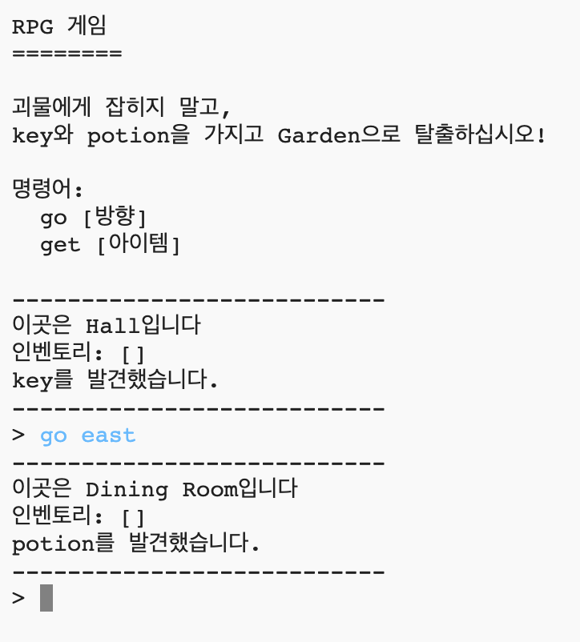

## 소개

In this project, you’ll design and code your own RPG maze game. The aim of the game will be to collect objects and escape from a house, making sure to avoid all the monsters!

  <iframe src="https://trinket.io/embed/python/d06adeb527?outputOnly=true&start=result" width="600" height="500" frameborder="0" marginwidth="0" marginheight="0" allowfullscreen>
  </iframe>
  

### 교육자들을 위한 추가 정보

이 프로젝트를 인쇄하려면 [프린트용 문서](https://projects.raspberrypi.org/en/projects/rpg/print)를 사용하십시오.

## \--- collapse \---

## 제목: 교육자 노트

## 소개

This project teaches game design through the development of an RPG maze game. In this game, the player has to pick up objects within a house and get to a specific room, while avoiding monsters lurking in some of the rooms. This game will be achieved by manipulating dictionaries and lists.

## 온라인 자료들

**이 프로젝트는 파이썬3를 사용합니다.** 파이썬 코드를 온라인에서 작성하기 위해 [Trinket](https://trinket.io/)을 사용하는것을 추천합니다. 이 프로젝트에 포함된 Trinket은 다음과 같습니다:

+ ['RPG' starting point -- jumpto.cc/rpg-go](http://jumpto.cc/rpg-go)

완성된 프로젝트를 포함한 Trinket도 있습니다:

+ [‘RPG’ Finished -- trinket.io/python/d06adeb527](https://trinket.io/python/d06adeb527)

## 오프라인 자료들

여러분의 선호에 따라 프로젝트를 [오프라인에서 완성](https://www.codeclubprojects.org/en-GB/resources/python-working-offline/)할 수 있습니다. 'Project Materials' 라는 링크를 클릭하여 이 프로젝트의 자료를 확인해볼 수 있습니다. 이 링크에는 어린이들이 프로젝트를 오프라인으로 완료하는 데 필요한 자료가 포함된 'Project Resource' 섹션이 있습니다. 각 어린이가 이러한 자료의 사본에 접근할 수 있는지 확인하십시오. 이 섹션에는 아래와 같은 파일들이 포함되어 있습니다.

+ rpg/rpg.py

You can also find the completed project project in the 'Volunteer Resources' section, which contains:

+ rpg-finished/rpg.py

(또한 위의 모든 자료는 프로젝트 및 자원봉사자 `.zip` 파일로 다운로드 할 수 있습니다.)

## 학습 목표

+ Game design;
+ 코드 편집: 
    + Python 리스트;
    + 딕셔너리.
+ Boolean expressions.

이 프로젝트는 [라즈베리파이 디지털 메이킹 커리큘럼](http://rpf.io/curriculum) 중 아래의 과정에 있는 요소들을 다룹니다.

+ [프로그래밍 구조를 결합하여 문제 해결하기](https://www.raspberrypi.org/curriculum/programming/builder)

## 도전과제

+ Adding new rooms;
+ Adding items to collect;
+ Adding enemies to avoid;
+ Develop your own game.

## 자주 물어보는 질문

+ 학생들에게 딕셔너리/리스트 목록의 요소가 쉼표로 구분된다는 것을 알려 주십시오. For example, when adding a new room to the 'rooms' dictionary, a comma needs to be added between the new room being added and the previous room.
+ When adding a new room, children may forget to add a link to an existing room to the newly created room. This will mean that children can leave a room, but not enter it!
+ The code for checking whether the player has won or lost the game needs to be indented, to ensure that this check is performed upon entering each new room. If the code isn't indented, then it sits outside of the main game loop and is never run.

\--- / collapse \---

## \--- collapse \---

## 타이틀: Project materials

## Project resources

+ [프로젝트의 모든 리소스가 들어있는 .zip 파일](resources/rpg-project-resources.zip)
+ [Online Trinket containing all 'RPG' project resources](http://jumpto.cc/rpg-go)
+ [rpg/rpg.py](resources/rpg-rpg.py)

## 교육자를 위한 자료

+ [완료된 프로젝트 리소스가 담긴 .zip 파일](resources/rpg-volunteer-resources.zip)
+ [완성된 온라인 Trinket 프로젝트](https://trinket.io/python/d06adeb527)
+ [rpg-finished/rpg.py](resources/rpg-finished-rpg.py)

\--- /collapse \---