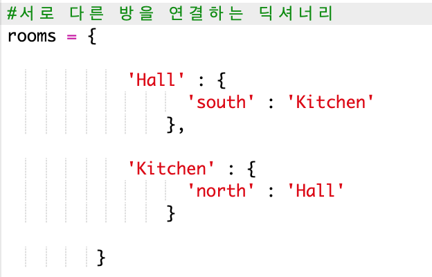
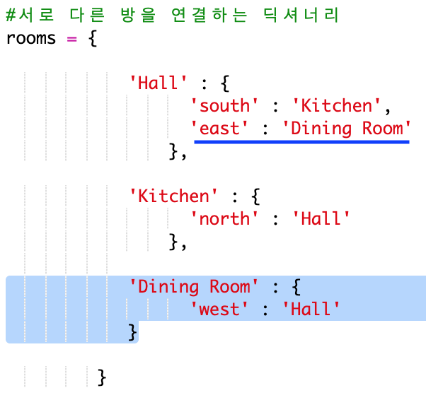

## 새로운 방 추가하기

+ 이 게임에 대한 기본적인 예제 코드가 제공됩니다. 다음 Trinket 파일을 열어주세요. <a href="http://jumpto.cc/rpg-go" target="_blank">jumpto.cc/rpg-go</a>.

+ 아주 간단한 RPG 게임으로 방이 2개밖에 없습니다. 아래 게임 맵을 참고해주세요:
    
    
    
    `go south` 명령어를 입력하여 hall에서 kitchen으로 이동할 수 있고, `go north` 명령어를 입력하여 다시 hall로 이동할 수 있습니다.
    
    

+ 만약 없는 방으로 가고자 한다면 어떻게 작동되나요? `go west`를 입력하면 친절한 에러 메시지를 출력하는 것을 볼 수 있습니다.
    
    

+ `rooms` 변수에서 여러 개의 방 정보가 딕셔너리 형태로 입력되어 있음을 알 수 있습니다:
    
    
    
    각 방은 딕셔너리 형태로 되어 있으며 서로 연결되어 있습니다.

+ 지도 상에서 dining room을 hall 동쪽에 추가해 봅시다.
    
    
    
    이제 세번째 방인 `dining room`을 딕셔너리에 추가해야 한다. 또한 hall을 서쪽에 링크해 주는 것 또한 필요하다. hall에도 dining room을 동쪽에 링크하여 플레이어가 hall에서 동쪽으로 이동 시 dining room으로 갈 수 있도록 한다.
    
    

+ 게임을 테스트해 보세요:
    
    
    
    만약 dining room으로 들어가거나 나갈 수 없다면, 추가한 코드를 다시 한번 살펴보세요(','와 같은 요소들도 잘 확인해보세요).