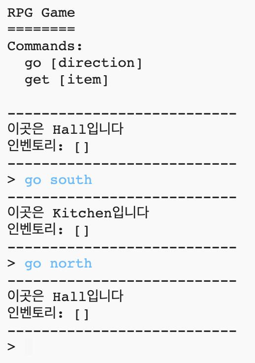
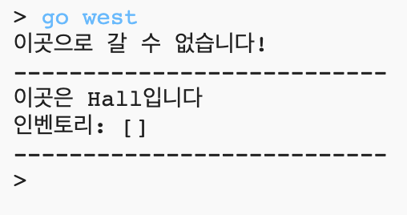
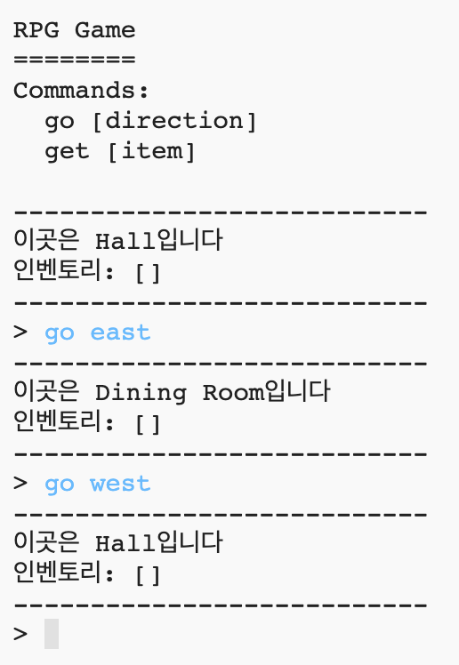

## 새로운 방 추가하기

\--- task \--- Open the Python starter project.

**Online**: open the starter project at [rpf.io/rpgon](http://rpf.io/rpgon){:target="_blank"}.

**Offline**: open the [starter project](http://rpf.io/p/en/rpg-go){:target="_blank"} in the offline editor. \--- /task \---

\--- task \--- This is a very basic RPG game that only has 2 rooms. 아래 게임 맵을 참고해주세요:

`go south` 명령어를 입력하여 hall에서 kitchen으로 이동할 수 있고, `go north` 명령어를 입력하여 다시 hall로 이동할 수 있습니다.

 \--- /task \---

\--- task \--- What happens when you type in a direction that you cannot go? `go west`를 입력하면 친절한 에러 메시지를 출력하는 것을 볼 수 있습니다.

 \--- /task \---

\--- task \--- If you find the `rooms` variable, you can see that the map is coded as a dictionary of rooms:

## \--- code \---

## language: python

# room 딕셔너리

rooms = {

            'Hall' : {
                'south' : 'Kitchen'
            },
    
            'Kitchen' : {
                'north' : 'Hall'
            }
    
        }
    

\--- /code \---

Each room is a dictionary, and rooms are linked together using directions.  
\--- /task \---

\--- task \--- Let’s add a dining room to your map, to the east of the hall.

You need to add a 3rd room, called the `dining room`, and link it to the hall (to the west). hall에도 dining room을 동쪽에 링크하여 플레이어가 hall에서 동쪽으로 이동 시 dining room으로 갈 수 있도록 한다.

**Don't forget that you'll also need to add commas to lines before your new code.**

## \--- code \---

language: python

## line_highlights: 5-6,11-15

# room 딕셔너리

rooms = {

            'Hall' : {
                'south' : 'Kitchen',
                'east' : 'Dining Room'
            },
    
            'Kitchen' : {
                'north' : 'Hall'
            },
    
            'Dining Room' : {
                'west' : 'Hall'
            }
    
        }
    

\--- /code \--- \--- /task \---

\--- task \--- Try out the game with your new dining room:

만약 dining room으로 들어가거나 나갈 수 없다면, 추가한 코드를 다시 한번 살펴보세요(','와 같은 요소들도 잘 확인해보세요). \--- /task \---