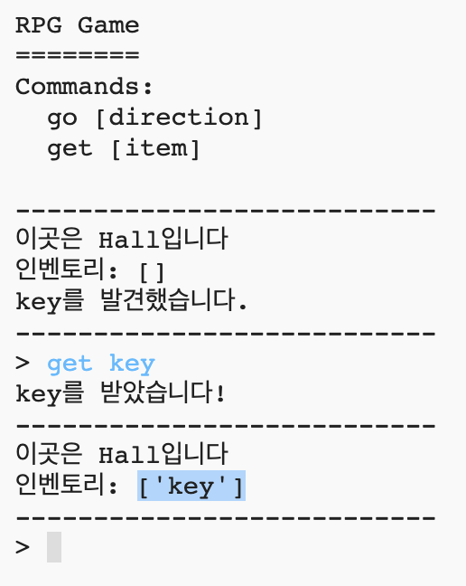

## 획득할 아이템 추가

플레이어가 미로를 탈출하면서 획득할 수 있는 아이템을 추가해 봅시다.

\--- task \---

Adding an item into a room is easy, you can just add it to a room's dictionary. Let’s put a key in the hall.

Remember to put a comma after the line above the new item, or your program won’t run!

## \--- code \---

language: python

## line_highlights: 6-7

# room 딕셔너리

rooms = {

            'Hall' : {
                'south' : 'Kitchen',
                'east' : 'Dining Room',
                'item' : 'key'
            },
    
            'Kitchen' : {
                'north' : 'Hall'
            },
    
            'Dining Room' : {
                'west' : 'Hall'
            }
    
        }
    

\--- /code \---

\--- /task \---

\--- task \---

If you run your game after adding the code above, you can now see a key in the hall, and you can even pick it up (by typing `get key`) which adds it to your inventory!

\--- /task \---