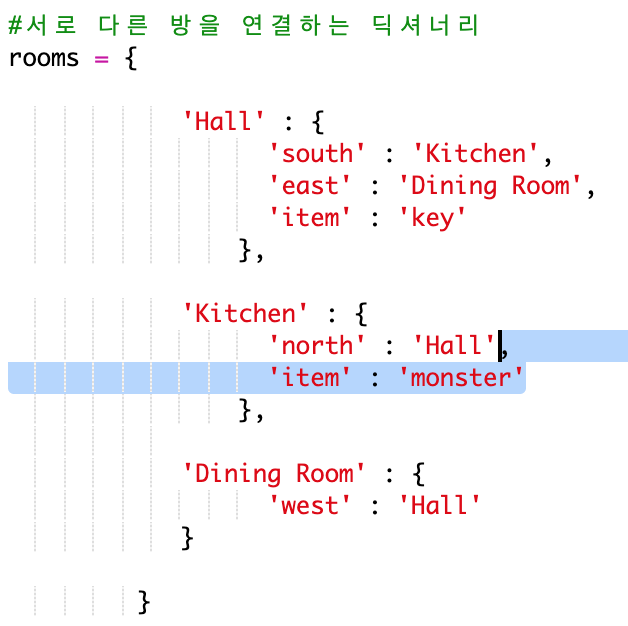
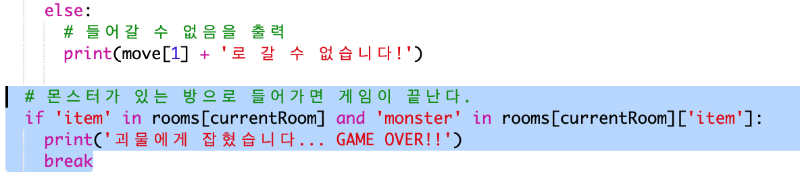
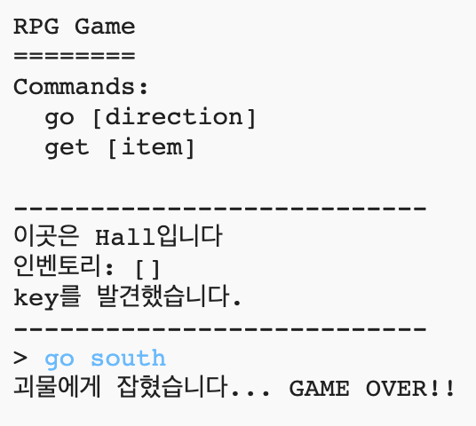

## 적 만들기

이 게임은 너무 쉽습니다. 이제 플레이어가 피해야만 하는 몬스터를 추가해서 조금 더 게임을 어렵게 만들어 봅시다.

+ 몬스터를 방 안에 추가하는 것은 다른 아이템을 추가하는 것 만큼 쉽습니다. 배고픈 몬스터를 kitchen에 추가해 봅시다:
    
    

+ 몬스터가 있는 방에 플레이어가 진입하는 경우 게임이 끝나야 합니다. 아래와 같이 명령어를 추가해서 게임 오버가 되도록 설정할 수 있습니다:
    
    
    
    이 코드는 플레이어가 있는 방에 있는 아이템을 확인하며, 몬스터인 경우 게임을 종료하도록 합니다. 이 코드는 들여 쓰기가 위 코드와 동일합니다. 이 코드는 플레이어가 새로운 방에 들어갈 때마다 몬스터가 있는지 확인합니다.

+ 몬스터가 있는 방인 kitchen으로 들어가 게임이 종료되는지 확인하십시오.
    
    