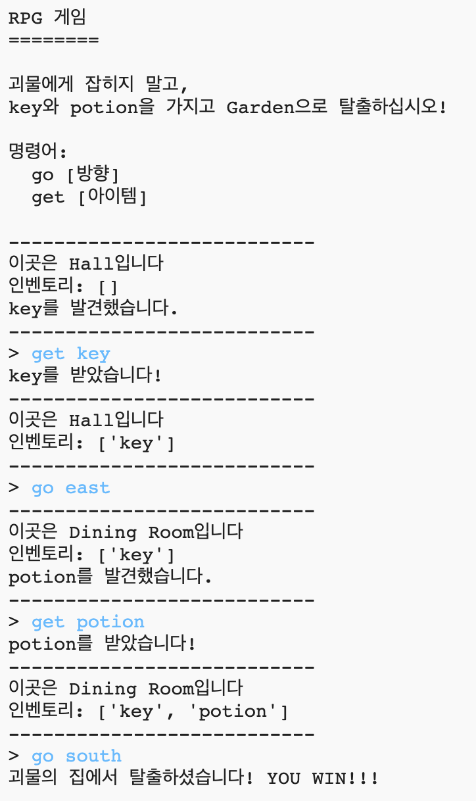
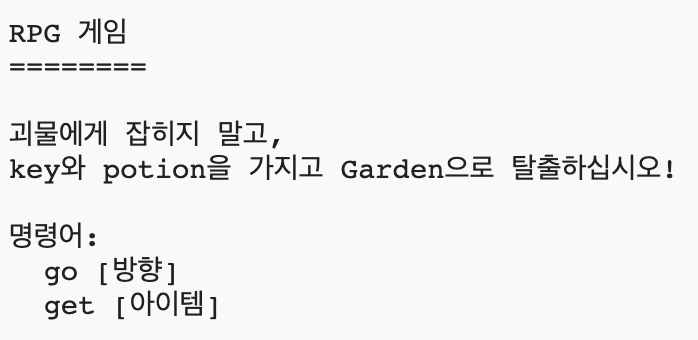

## 게임 클리어하기

플레이어가 게임을 클리어하기 위한 미션을 부여해 봅시다.

\--- task \--- 플레이어가 garden으로 이동하여 집을 탈출했을 때 이 게임을 클리어할 수 있습니다. 물론, key와 magic potion을 소지하고 나가야 합니다. 아래 게임 맵을 참고하세요.

 \--- /task \---

\--- task \--- 먼저, dining room 남쪽에 garden을 추가해야 합니다. 꼭 두 방을 서로 링크하는 것 잊지 마세요.

## \--- code \---

language: python

## line_highlights: 16-17,18-22

# room 딕셔너리

rooms = {

            'Hall' : {
                'south' : 'Kitchen',
                'east' : 'Dining Room',
                'item' : 'key'
            },
    
            'Kitchen' : {
                'north' : 'Hall',
                'item' : 'monster'
            },
    
            'Dining Room' : {
                'west' : 'Hall',
                'south' : 'Garden'
            },
    
            'Garden' : {
                'north' : 'Dining Room'
            }
    
        }
    

\--- /code \--- \--- /task \---

\--- task \--- Potion을 dining room에 추가합니다. (다른 방에 추가해도 괜찮습니다.)

## \--- code \---

language: python

## line_highlights: 3-4

            'Dining Room' : {
                'west' : 'Hall',
                'south' : 'Garden',
                'item' : 'potion'
            },
    

\--- /code \--- \--- /task \---

\--- task \--- 아래 코드를 추가하여 플레이어가 key, potion을 소지하고 garden으로 탈출했을 때 게임 클리어 메시지가 출력되도록 합시다.

## \--- code \---

language: python

## line_highlights: 6-9

# 몬스터가 있는 방으로 들어가면 게임이 끝난다

if 'item' in rooms\[currentRoom] and 'monster' in rooms[currentRoom\]\['item'\]: print('괴물에게 잡혔습니다... GAME OVER!') break

# 키와 포션을 가지고 Garden으로 가면 탈출 성공

if currentRoom == 'Garden' and 'key' in inventory and 'potion' in inventory: print('괴물의 집에서 탈출하셨습니다! YOU WIN!') break \--- /code \---

이 코드는 들여 쓰기가 위 코드와 동일합니다. 이 코드는 플레이어가 인벤토리 내 key, potion을 소지하고 garden으로 탈출했을 때 `괴물의 집에서 탈출하셨습니다! YOU WIN!!!`을 출력하는 코드입니다.

4 개 이상의 방이 있는 경우 위의 코드에서 다른 방 번호를 사용해야 할 것입니다. \--- /task \---

\--- task \--- 게임을 테스트해 클리어 메시지가 출력되는지 확인해 봅시다!

 \--- /task \---

\--- task \--- 마지막으로, 게임 플레이에 대한 안내를 출력해 봅시다. `showInstructions()` 함수를 수정해서 더 많은 정보를 출력하도록 합니다.

## \--- code \---

language: python

## line_highlights: 7-8

def showInstructions(): #메인메뉴와 명령어 출력 print('''

# RPG 게임

괴물에게 잡히지 말고, key와 potion을 가지고 Garden으로 탈출하십시오!

명령어: go [direction] get [item] ") \--- /code \---

정보를 한국어로 어떤 아이템을 가지고 탈출해야 하는지, 무엇을 조심해야 하는지 자세히 명시해야 합니다. \--- /task \---

\--- task \--- 게임을 테스트하여 정보가 출력되는지 확인해 보세요.

 \--- /task \---