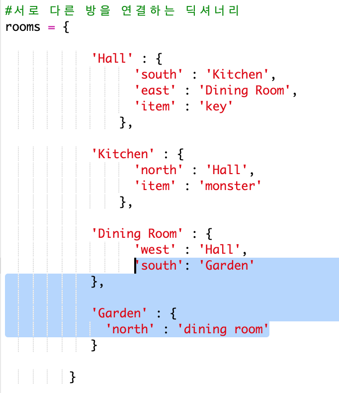
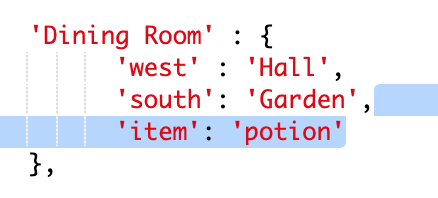
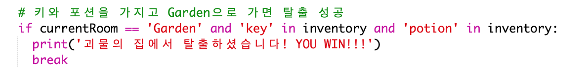
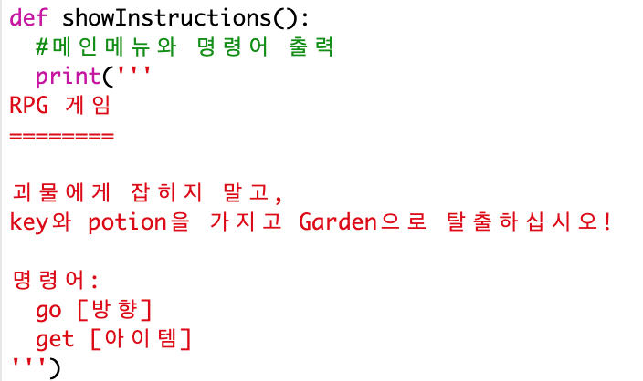

## 게임 클리어하기

플레이어가 게임을 클리어하기 위한 미션을 부여해 봅시다.

+ 플레이어가 garden으로 이동하여 집을 탈출했을 때 이 게임을 클리어할 수 있습니다. 물론, key와 magic potion을 소지하고 나가야 합니다. 아래 게임 맵을 참고하세요.
    
    

+ 먼저, dining room 남쪽에 garden을 추가해야 합니다. 꼭 두 방을 서로 링크하는 것 잊지 마세요.
    
    

+ Potion을 dining room에 추가합니다. (다른 방에 추가해도 괜찮습니다.)
    
    

+ 아래 코드를 추가하여 플레이어가 key, potion을 소지하고 garden으로 탈출했을 때 게임 클리어 메시지가 출력되도록 합시다.
    
    
    
    이 코드는 들여 쓰기가 위 코드와 동일합니다. 이 코드는 플레이어가 인벤토리 내 key, potion을 소지하고 garden으로 탈출했을 때 `괴물의 집에서 탈출하셨습니다! YOU WIN!!!`을 출력하는 코드입니다.
    
    4 개 이상의 방이 있는 경우 위의 코드에서 다른 방 번호를 사용해야 할 것입니다.

+ 게임을 테스트해 클리어 메시지가 출력되는지 확인해 봅시다!
    
    

+ 마지막으로, 게임 플레이에 대한 안내를 출력해 봅시다. `showInstructions()` 함수를 수정해서 더 많은 정보를 출력하도록 합니다.
    
    
    
    정보를 한국어로 어떤 아이템을 가지고 탈출해야 하는지, 무엇을 조심해야 하는지 자세히 명시해야 합니다.

+ 게임을 테스트하여 정보가 출력되는지 확인해 보세요.
    
    