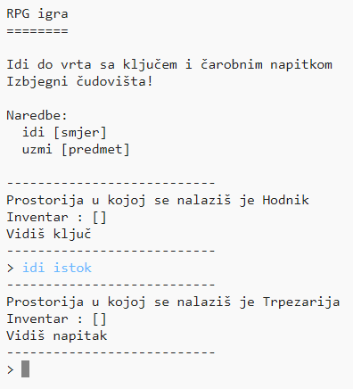

## Uvod:

U ovom projektu ćeš dizajnirati i kodirati sopstvenu RPG igru lavirinta. Cilj igre je sakupiti predmete i pobjeći iz kuće, izbjegavajući sva čudovišta!

  <iframe src="https://trinket.io/embed/python/d06adeb527?outputOnly=true&start=result" width="600" height="500" frameborder="0" marginwidth="0" marginheight="0" allowfullscreen>
  </iframe>
  

### Dodatne informacije za vođe kluba

Ukoliko je potrebno da odštampate ovaj projekat, koristite [Verziju za štampu](https://projects.raspberrypi.org/en/projects/rpg/print).

## \--- collapse \---

## title: Bilješke za vođe kluba

## Uvod:

U ovom projektu djeca uče o dizajnu igara kroz izradu RPG igre lavirinta. U ovoj igri igrač treba da sakupi predmete unutar kuće i da dođe do određene prostorije, izbjegavajući pritom čudovišta koja vrebaju u nekim prostorijama. Ova igra će biti izrađena uz upotrebu rječnika i listi.

## Online izvori

**U ovom projektu koristi se Python 3.** Preporučujemo korišćenje [trinketa](https://trinket.io/) za online pisanje u Pythonu. Ovaj projekat sadrži sljedeće Trinkete:

+ [Početak projekta 'RPG' -- jumpto.cc/rpg-go](http://jumpto.cc/rpg-go)

Takođe postoji trinket koji sadrži završen projekat:

+ [Završen projekat 'RPG' -- trinket.io/python/d06adeb527](https://trinket.io/python/d06adeb527)

## Offline izvori

Ako želite, ovaj projekat može biti [izrađen offline](https://www.codeclubprojects.org/en-GB/resources/python-working-offline/). Izvorima projekta možete pristupiti klikom na link projekta 'Projektni materijali'. Navedeni link sadrži odjeljak 'Izvori projekta' u kojem se nalaze izvori koji će djeci biti potrebni kako bi izradila ovaj projekat offline. Obezbijedite da svako dijete ima pristup kopiji ovih izvora. Odjeljak sadrži sljedeće datoteke:

+ rpg/rpg.py

Takođe, završenu verziju ovoga projekta možete naći u odjeljku 'Izvori za volontere' koji sadrži:

+ rpg-finished/rpg.py

(Sve navedene izvore moguće je preuzeti kao `.zip` datoteke.)

## Ciljevi učenja

+ Dizajn igara;
+ Uređivanje: 
    + Listi;
    + Rječnika.
+ Bulovi izrazi.

Ovim projektom obuhvaćeni su elementi iz sljedećih dijelova [Raspberry Pi Digital Making Curriculum](http://rpf.io/curriculum):

+ [Kombinujte programske konstrukcije za rješavanje problema.](https://www.raspberrypi.org/curriculum/programming/builder)

## Izazovi

+ Dodavanje novih prostorija;
+ Dodavanje predmeta za sakupljanje;
+ Dodavanje neprijatelja za izbjegavanje;
+ Osmisli sopstvenu igru.

## Često postavljana pitanja

+ Možda će biti potrebno podsjetiti djecu da se elementi rječnika/liste odvajaju zarezima. Na primjer, kada dodaju novu prostoriju u rječnik 'prostorije', između nove dodate prostorije i prethodne prostorije treba da dodaju zarez.
+ Pri dodavanju nove prostorije, djeca će možda zaboraviti da novoj prostoriji dodaju vezu za već postojeću prostoriju. To znači da će djeca moći da izađu iz prostorije, ali ne i da uđu u nju!
+ Kôd za provjeru da li je igrač pobijedio ili izgubio u igri mora da bude uvučen kako bi se obezbijedilo da se ova provjera vrši prilikom svakog ulaska u novu prostoriju. Ako kôd nije uvučen, nalaziće se izvan glavne petlje igre i nikada se neće izvršiti.

\--- /collapse \---

## \--- collapse \---

## title: Projektni materijali

## Izvori projekta

+ [.zip datoteka koja sadrži sve izvore projekta](resources/rpg-project-resources.zip)
+ [Online Trinket koji sadrži sve izvore projekta 'RPG'](http://jumpto.cc/rpg-go)
+ [rpg/rpg.py](resources/rpg-rpg.py)

## Izvori za vođe kluba

+ [.zip datoteka koja sadrži sve završene izvore projekta](resources/rpg-volunteer-resources.zip)
+ [Završen Trinket projekat online](https://trinket.io/python/d06adeb527)
+ [rpg-finished/rpg.py](resources/rpg-finished-rpg.py)

\--- /collapse \---