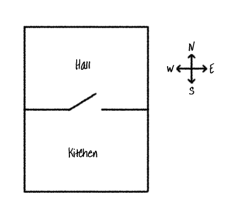

## Dodavanje novih prostorija

+ Dio kôda za ovu igru već smo pripremili za tebe. Otvori sljedeći trinket: <a href="http://jumpto.cc/rpg-go" target="_blank">jumpto.cc/rpg-go</a>.

+ Ovo je vrlo jednostavna RPG igra koja ima samo dvije prostorije. Ovo je nacrt igre:
    
    
    
    Možeš da upišeš `idi jug` za prelazak iz hodnika u kuhinju, a zatim `idi sjever` za povratak u hodnik!
    
    

+ Šta se dešava kada upišeš smjer u kojem ne možeš ići? Upiši `idi zapad` dok si u hodniku i dobićeš ljubaznu poruku o grešci.
    
    

+ Pronađi promjenljivu `prostorije` i vidjećeš da je nacrt kodiran kao rječnik prostorija:
    
    
    
    Svaka prostorija je jedan rječnik, a prostorije su međusobno povezane smjerovima.

+ Dodajmo u nacrt trpezariju, istočno od hodnika.
    
    
    
    Moraš dodati treću prostoriju koju ćeš nazvati `trpezarija`. Takođe je moraš povezati sa hodnikom na zapadu. Treba i hodniku da dodaš podatke kako bi mogao/mogla preći u trpezariju na istoku.
    
    

+ Isprobaj igru sada kada je dodata trpezarija:
    
    
    
    Ako ne možeš da pređeš u trpezariju i izađeš iz nje, provjeri da li si dodao/dodala cijeli kôd koji se nalazi iznad (uključujući i dodatne zareze u redovima).