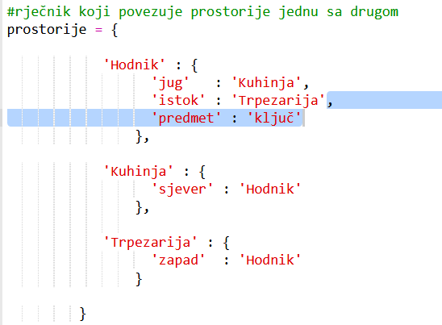
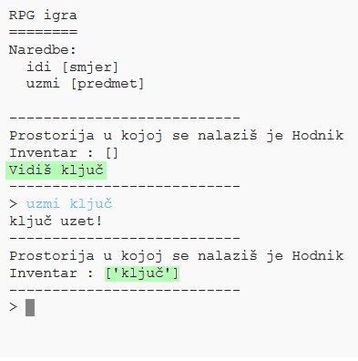

## Dodavanje predmeta za sakupljanje

U prostorije ćemo postaviti predmete koje će igrač sakupljati dok se bude kretao kroz lavirint.

+ Dodavanje predmeta u prostoriju je lako - jednostavno ga dodaj u rječnik prostorije. Postavimo ključ u hodnik.
    
    
    
    Ne zaboravi da staviš zarez na kraju reda iznad novog unosa ili tvoj program neće raditi!

+ Ako sada, nakon dodavanja prethodnog kôda, pokreneš svoju igru, u hodniku ćeš vidjeti ključ koji možeš čak i pokupiti (upisivanjem `uzmi ključ`) i tako ga dodati u svoj inventar!
    
    