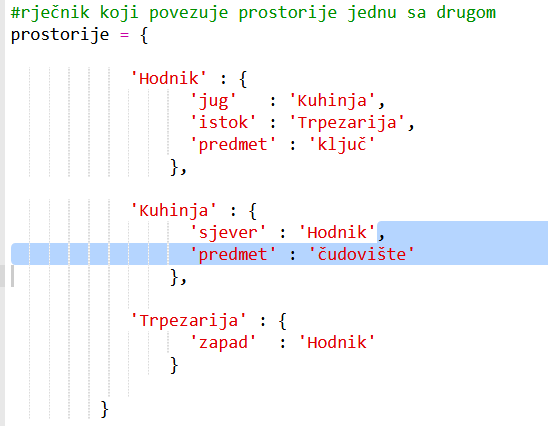
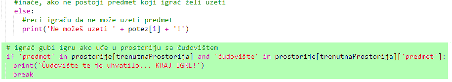
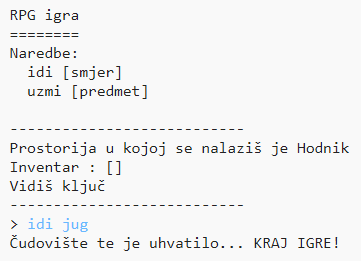

## Dodavanje neprijatelja

Ova igra je previše laka! Dodajmo u neke od prostorija neprijatelje koje će igrač morati da izbjegava.

+ Dodavanje neprijatelja u prostoriju jednostavno je kao i dodavanje bilo kojeg drugog predmeta. Dodajmo gladno čudovište u kuhinju:
    
    

+ Takođe treba da obezbijediš da se igra završi ako igrač uđe u prostoriju u kojoj se nalazi čudovište. To možeš da uradiš koristeći sljedeći kôd koji treba da dodaš na kraju igre:
    
    
    
    Ovaj kôd provjerava da li se neki predmet nalazi u prostoriji i, ako se nalazi, da li je taj predmet čudovište. Imaj u vidu da je ovaj kôd uvučen, tako da je poravnat sa kôdom iznad njega. To znači da će igra provjeravati postoji li čudovište u prostoriji svaki put kada igrač uđe u novu prostoriju.

+ Isprobaj svoj kôd tako što ćeš ući u kuhinju u kojoj se sada nalazi čudovište.
    
    