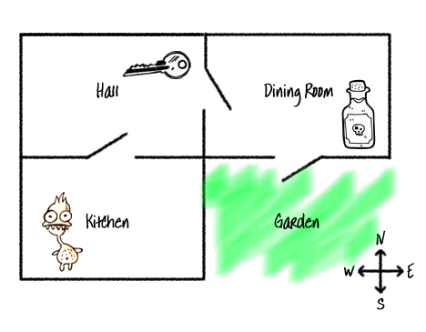

## Pobjeda u igri

Dajmo tvom igraču zadatak koji mora da izvrši da bi pobijedio u igri.

+ U ovoj igri igrač će pobijediti ako stigne do vrta i pobjegne iz kuće. Takođe mora imati ključ i čarobni napitak. Ovo je nacrt igre.
    
    

+ Prvo moraš da dodaš vrt južno od trpezarije. Ne zaboravi da dodaš vrata kako bi vrt bio povezan sa ostalim prostorijama u kući.
    
    

+ Dodaj čarobni napitak u trpezariju (ili u neku drugu prostoriju u kući).
    
    

+ Dodaj sljedeći kôd kojim ćeš omogućiti da igrač pobijedi ako dođe do vrta sa ključem i čarobnim napitkom:
    
    
    
    Pobrini se da kôd bude uvučen i poravnat sa kôdom iznad njega. Ovaj kôd znači da će poruka `Pobjegao/pobjegla si iz kuće...POBIJEDIO/POBIJEDILA SI!` biti prikazana ako se igrač nalazi u vrtu (prostoriji 4) i u svom inventaru ima ključ i čarobni napitak.
    
    Ako imaš više od četiri prostorije, možda ćeš u kôdu iznad morati da koristiš drugi broj prostorije za svoj vrt.

+ Isprobaj svoju igru i provjeri može li igrač da pobijedi!
    
    

+ Na kraju, dodajmo uputstva u tvoju igru kako bi igrač znao šta treba da radi. Izmijeni funkciju `prikaziUputstva()` tako da sadrži više informacija.
    
    
    
    Treba da dodaš uputstva koja govore igraču koje predmete treba da sakupi i šta treba da izbjegava!

+ Isprobaj svoju igru. Trebalo bi da vidiš svoja nova uputstva.
    
    