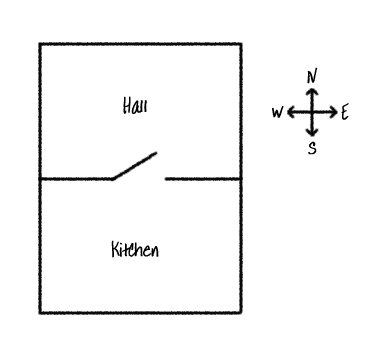

## नवीन खोल्या जोडा

--- task ---

Python प्रारंभिक प्रकल्प उघडा.

**Online:** इथे प्रारंभिक प्रकल्प उघडा [rpf.io/rpgon](http://rpf.io/rpgon){:target="_blank"}.

**Offline**: [प्रारंभिक प्रकल्प](http://rpf.io/p/mr-IN/rpg-go){:target="_blank"} ऑफलाइन संपादकात उघडा.

--- /task ---

--- task ---

हा एक मूलभूत RPG खेळ आहे ज्यामध्ये फक्त 2 खोल्या आहेत. खेळाचा नकाशा येथे आहेः

तुम्ही दिवाणखान्यातून स्वयंपाकघरात जाण्यासाठी `go south` आणि नंतर पुन्हा हॉलमध्ये जाण्यासाठी `go north` टाइप करू शकता !

--- /task ---

--- task ---

तुम्हाला जाऊ शकत नाही अशी दिशा टाइप करता तेव्हा काय होते? हॉलमध्ये `go west` टाइप करा आणि तुम्हाला एक अनुकूल त्रुटी संदेश मिळेल.

--- /task ---

--- task ---

तुम्हाला `rooms` चल आढळल्यास, तुम्ही पाहू शकता की नकाशा खोल्यांचा शब्दकोष म्हणून कोडित केला आहे:

--- code ---
---
language: python
---
# एका खोलीला इतर खोल्यांशी जोडणारा शब्दकोश
rooms = {

            'Hall' : {
                'south' : 'Kitchen'
            },

            'Kitchen' : {
                'north' : 'Hall'
            }

        }
--- /code ---

प्रत्येक खोली एक शब्दकोश आहे आणि दिशानिर्देशांचा वापर करून खोल्या एकत्र जोडल्या गेल्या आहेत.

--- /task ---

--- task ---

दिवाण खाण्याच्या पूर्वेस आपल्या नकाशावर जेवणाची खोली जोडू.

तुम्हाला तिसरी खोली जोडण्याची आवश्यकता आहे, जी `dining room` आहे, आणि दिवाणखान्या सोबत (पश्चिमेस) जोडली आहे. तुम्हाला दिवाण खाण्यात काही गोष्टी जोडण्याची देखील आवश्यकता आहे, जेणेकरून आपण जेवणाच्या खोलीत पूर्वेस जाऊ शकता.

**तुम्ही नवीन कोडच्या आधी तुम्हाला ओळींमध्ये स्वल्पविराम देखील जोडण्याची आवश्यकता आहे हे विसरू नका.**

--- code ---
---
language: python
line_highlights: 5-6,11-15
---
# एका खोलीला इतर खोल्यांशी जोडणारा शब्दकोश
rooms = {

            'Hall' : {
                'south' : 'Kitchen',
                'east' : 'Dining Room'
            },

            'Kitchen' : {
                'north' : 'Hall'
            },

            'Dining Room' : {
                'west' : 'Hall'
            }

        }
--- /code ---

--- /task ---

--- task ---

तुमच्या नवीन स्वयंपाकघरासह खेळ वापरून पहा:

तुम्ही जेवणाच्या खोलीत आणि बाहेर जाऊ शकत नाही, तर फक्त तुम्ही वरील सर्व कोड जोडला असल्याचे तपासा (वरील ओळींमध्ये अतिरिक्त स्वल्पविरामांसह).

--- /task ---