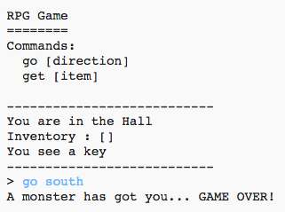

## शत्रू जोडा

हा खेळ खूप सोपा आहे! चला खेळाडूंनी टाळलेल्या काही खोल्यांमध्ये शत्रू जोडूया.

\--- task \---

खोलीत शत्रू जोडणे इतर कोणत्याही वस्तू जोडण्याइतकेच सोपे आहे. चला स्वयंपाकघरात भुकेले राक्षस जोडूया:

## \--- code \---

भाषा: python

## line_highlights: 11-12

# एका खोलीला इतर खोल्यांशी जोडणारा शब्दकोश

rooms = {

            'Hall' : {
                'south' : 'Kitchen',
                'east' : 'Dining Room',
                'item' : 'key'
            },
    
            'Kitchen' : {
                'north' : 'Hall',
                'item' : 'monster'
            },
    
            'Dining Room' : {
                'west' : 'Hall'
            }
    
        }
    

\--- /code \---

\--- /task \---

\--- task \---

तुम्हाला हे देखील सुनिश्चित करायचे आहे की जर खेळाडू एखाद्या राक्षस असलेल्या खोलीत प्रवेश करेल तर गेम संपेल. तुम्ही खेळाच्या शेवटी पुढील कोड जोडून हे करू शकता:

## \--- code \---

language: python

## line_highlights: 6-9

        #otherwise, if the item isn't there to get
        else:
            #tell them they can't get it
            print('Can\'t get' + move[1] + '!')
    
    #player loses if they enter a room with a monster
    if 'item' in rooms[currentRoom] and 'monster' in rooms[currentRoom]['item']:
        print('A monster has got you... GAME OVER!')
        break
    
    

\--- /code \---

हा कोड खोलीत एखादी वस्तू आहे की नाही तपासते आणि तसे असल्यास ती वस्तू राक्षस आहे की नाही तपासते. लक्षात घ्या की ह्या कोडचा उद्देश आहे की, त्यास वरील कोडच्या अनुरुप ठेवणे. याचा अर्थ असा आहे की प्रत्येक वेळी खेळाडू नवीन खोलीत प्रवेश करतो तेव्हा खेळात राक्षस असल्याची तपासणी करेल.

\--- /task \---

\--- task \---

स्वयंपाकघरात जाऊन आपल्या कोडची चाचणी घ्या, ज्यात आता एक राक्षस आहे.

\--- /task \---