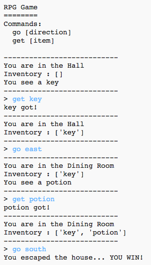

## खेळ जिंकणे

चला तुमच्या खेळाडूला एक आवाहन द्या, ज्यास खेळ जिंकण्यासाठी पूर्ण करणे आवश्यक आहे.

--- task ---

या खेळामध्ये, खेळाडू घरातून बाहेर पडून आणि बागेत जाऊन जिंकेल. त्याबरोबर देखिल त्यांच्याकडे चावी आणि जादूच्या औषधाचा किंवा विषाचा घोट असणे आवश्यक आहे. खेळाचा नकाशा येथे आहे.

--- /task ---

--- task ---

पहिल्यांदा, तुम्हाला जेवणाच्या खोलीच्या दक्षिणेस एक बाग जोडण्याची आवश्यकता आहे. घराच्या इतर खोल्यांमध्ये दुवा जोडण्यासाठी, दारे जोडणे लक्षात ठेवा.

--- code ---
---
language: python
line_highlights: 16-17,18-22
---
# एका खोलीला इतर खोल्यांशी जोडणारा शब्दकोश
rooms = {

            'Hall' : {
                'south' : 'Kitchen',
                'east' : 'Dining Room',
                'item' : 'key'
            },

            'Kitchen' : {
                'north' : 'Hall',
                'item' : 'monster'
            },

            'Dining Room' : {
                'west' : 'Hall',
                'south' : 'Garden'
            },

            'Garden' : {
                'north' : 'Dining Room'
            }

        }
        
--- /code ---

--- /task ---

--- task ---

जेवणाच्या खोलीत औषधाचा किंवा विषाचा घोट जोडा (किंवा घरातील एखाद्या दुसऱ्या खोलीत).

--- code ---
---
language: python
line_highlights: 3-4
---
            'Dining Room' : {
                'west' : 'Hall',
                'south' : 'Garden',
                'item' : 'potion'
            },
--- /code ---

--- /task ---

--- task ---

जेव्हा खेळाडू चाव्या आणि औषधाचा घोट घेवून बागेत पोहोचल्यास खेळाडूस जिंकण्यासाठी हा कोड जोडा:

--- code ---
---
language: python
line_highlights: 6-9
---
# राक्षस असलेल्या खोलीत प्रवेश केला तर खेळाडू हरेल
if 'item' in rooms[currentRoom] and 'monster' in rooms[currentRoom]['item']:
    print('A monster has got you... GAME OVER!')
    break

# खेळाडू चाव्या आणि औषधाचा किंवा विषाचा घोट घेवून बागेत पोहोचल्यास खेळाडू जिंकतो
if currentRoom == 'Garden' and 'key' in inventory and 'potion' in inventory:
    print('You escaped the house... YOU WIN!')
    break

--- /code ---

लक्षात घ्या की ह्या कोडचा उद्देश आहे की, त्यास वरील कोडच्या अनुरुप ठेवणे. या कोडचा अर्थ असा आहे की जर खेळाडू खोली 4 (बाग) मध्ये असेल तर `You escaped the house...YOU WIN!` हा संदेश आणि चाव्या आणि औषधाचा घोट यादीमध्ये असल्यास ते प्रदर्शित केले जाईल.

जर तुमच्याकडे 4 पेक्षा अधिक खोल्या असतील, तुमच्या वरील कोडमधे तुम्ही बागेसाठी वेगळा क्रमांक वापरा.

--- /task ---

--- task ---

तुमच्या खेळाची चाचणी घ्या की खेळाडू जिंकू शकतो हे सुनिश्चित करण्यासाठी!

--- /task ---

--- task ---

शेवटी, तुमच्या खेळामध्ये काही सूचना जोडा, जेणेकरुन त्या खेळाडूला काय करावे लागेल हे कळू शकेल. अधिक माहिती समाविष्ट करण्यासाठी `showInstructions()` फंक्शन संपादित करा.

--- code ---
---
language: python
line_highlights: 7-8
---
def showInstructions():
    #print a main menu and the commands
    print('''
RPG Game
========

Get to the Garden with a key and a potion
Avoid the monsters!

Commands:
go [direction]
get [item]
''')

--- /code ---

वापर करत्यांनी कोणते साहित्य संकलित करावे आणि त्यांनी काय टाळावे हे सांगण्यासाठी तुम्हाला सूचना जोडण्याची आवश्यकता असेल!

--- /task ---

--- task ---

तुमच्या खेळाची चाचणी घ्या आणि तुम्ही तुमच्या नवीन सूचना पाहिल्या पाहिजेत.

--- /task ---