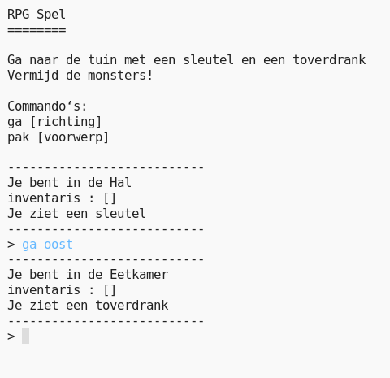

## Inleiding:

In dit project ontwerp en programmeer je je eigen RPG doolhofspel. Het doel van het spel is om voorwerpen te verzamelen en uit het huis te ontsnappen terwijl je monsters probeert te ontwijken!

  <iframe src="https://trinket.io/embed/python/76b6a79f0c?outputOnly=true&start=result" width="600" height="500" frameborder="0" marginwidth="0" marginheight="0" allowfullscreen>
  </iframe>
  

### Aanvullende informatie voor clubleiders

Als je dit project wilt afdrukken, gebruik dan de [printvriendelijke versie](https://projects.raspberrypi.org/nl-NL/projects/rpg/print).

--- collapse ---
---
title: Opmerkingen voor clubleiders
---
## Inleiding:

Dit project gaat om spelontwerp door middel van het ontwikkelen van een RPG doolhofspel. In dit spel moet de speler in een huis voorwerpen oppakken en naar een bepaalde kamer gaan, onderweg monsters vermijdend die in sommige kamers op de loer liggen. Dit spel wordt tot stand gebracht door gebruik te maken van woordenboeken (dictionaries) en lijsten.

## Online bronnen

**Dit project maakt gebruik van Python 3.** We raden aan om [trinket](https://trinket.io/) te gebruiken om Python online te schrijven. Dit project bevat de volgende Trinkets:

+ ['RPG' startpunt -- trinket.io/python/20ef3590af](http://trinket.io/python/20ef3590af)

Er is ook een trinket met het voltooide project:

+ [‘RPG’ Gereed -- trinket.io/python/76b6a79f0c](https://trinket.io/python/76b6a79f0c)

## Offline bronnen

Dit project kan [offline worden voltooid](https://www.codeclubprojects.org/en-GB/resources/python-working-offline/) als dit de voorkeur heeft. Je kunt toegang krijgen tot de projectbronnen door op de koppeling 'Projectmaterialen' voor dit project te klikken. Deze link bevat een 'Projectbronnen'-sectie, met bronnen die kinderen nodig hebben om dit project offline kunnen voltooien. Zorg ervoor dat elk kind toegang heeft tot een kopie van deze bestanden. Dit gedeelte bevat de volgende bestanden:

+ rpg/rpg.py

Je kunt een voltooide versie van dit project vinden in de sectie 'Vrijwilligersbronnen', die het volgende bevat:

+ rpg-finished/rpg.py

(Alle bovenstaande bronnen kunnen ook worden gedownload als project en als vrijwilliger `.zip` bestanden.)

## Leerdoelen

+ Spelontwerp;
+ Bewerken: 
    + Lijsten (Engels: lists);
    + Woordenboeken (Engels: dictionaries).
+ Booleaanse expressies.

Dit project behandelt elementen uit de volgende onderdelen van het [Raspberry Pi Digital Making Curriculum](http://rpf.io/curriculum):

+ [Combineer programmeerconstructies om een ​​probleem op te lossen.](https://www.raspberrypi.org/curriculum/programming/builder)

## Uitdagingen

+ Voeg nieuwe kamers toe;
+ Voorwerpen toevoegen om te verzamelen;
+ Te vermijden vijanden toevoegen;
+ Ontwikkel je eigen spel.

## Veelgestelde vragen (faq)

+ Kinderen moeten er mogelijk aan herinnerd worden dat elementen van een woordenboek/lijst moeten worden gescheiden door een komma. Bijvoorbeeld, bij het toevoegen van een kamer in het 'kamers' woordenboek moet er een komma worden toegevoegd tussen de nieuwe en een bestaande kamer.
+ Bij het toevoegen van een kamer kunnen kinderen vergeten om een verbinding te maken tussen een bestaande en nieuw gemaakte kamer. Dat heeft tot gevolg dat een kamer wel kan worden verlaten maar niet kan worden binnengegaan!
+ De code die controleert of een speler heeft gewonnen of verloren moet zijn ingesprongen, om er zeker van te zijn dat deze controle is gedaan voor er een nieuwe kamer wordt betreden. Als de code niet inspringt staat het buiten het bereik van de hoofdlus en wordt het nooit uitgevoerd.

--- /collapse ---

--- collapse ---
---
title: Projectmaterialen
---
## Projectbronnen

+ [.zip-bestand met alle projectbronnen](resources/rpg-project-resources.zip)
+ [Online Trinket met alle 'RPG' projectbronnen](http://trinket.io/python/20ef3590af)
+ [rpg/rpg.py](resources/rpg-rpg.py)

## Clubleider bronnen

+ [.zip-bestand met alle voltooide projectbronnen](resources/rpg-volunteer-resources.zip)
+ [Online voltooid Trinket-project](https://trinket.io/python/76b6a79f0c)
+ [rpg-finished/rpg.py](resources/rpg-finished-rpg.py)

--- /collapse ---