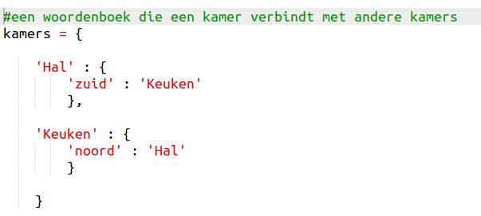
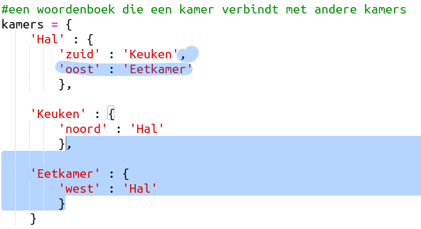

## Voeg nieuwe kamers toe

+ Er is al wat code voor je klaargezet. Open this trinket: <a href="http://trinket.io/python/20ef3590af" target="_blank">trinket.io/python/20ef3590af</a>.

+ Dit is een erg eenvoudig RPG spel met maar 2 kamers. Hier is een kaart van het spel:
    
    
    
    Je kunt `ga zuid` typen om van de hal naar de keuken te lopen, en dan `ga noord` om weer terug naar de hal te gaan.
    
    

+ Wat gebeurt er als je een richting intypt waar je niet heen kan gaan? Typ `ga west` in de hal en je krijgt een aardig foutberichtje.
    
    

+ Als je de `kamers` variabele opzoekt zie je dat de kaart is geprogrammeerd met een woordenboek van kamers:
    
    
    
    Elke kamer is een woordenboek en de kamers zijn met elkaar verbonden met behulp van richtingen.

+ Laten we een eetkamer toevoegen aan de kaart, ten oosten van de hal.
    
    
    
    Je hebt een derde kamer nodig, die `eetkamer` heet. Je moet het ook nog verbinden met de hal in het westen. Je moet ook nog gegevens toevoegen aan de hal, om naar de eetkamer in het oosten te kunnen gaan.
    
    

+ Probeer het spel uit met de nieuwe eetkamer:
    
    
    
    Als je niet in of uit de eetkamer kunt komen moet je de code hierboven nog eens goed bekijken (ook de extra komma's in de regels hierboven).