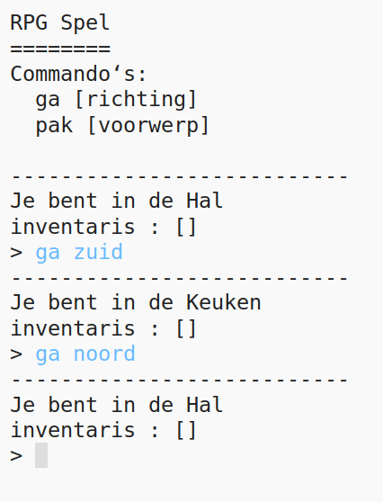
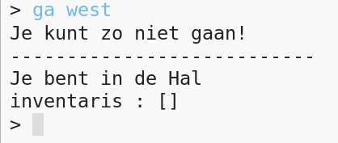
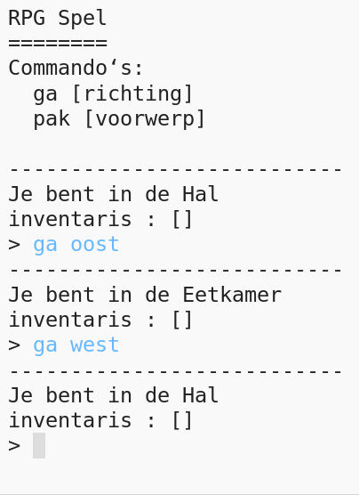

## Voeg nieuwe kamers toe

\--- task \--- Open het Python startersproject.

**Online**: open het start project op [rpf.io/rpgon](http://rpf.io/rpgon){:target="_ blank"}.

**Offline**: open het [start project](http://rpf.io/p/en/rpg-go){:target="_ blank"} in de offline editor. \--- /task \---

\--- task \--- Dit is een erg eenvoudig RPG spel met maar 2 kamers. Hier is een kaart van het spel:

Je kunt `ga zuid` typen om van de hal naar de keuken te lopen, en dan `ga noord` om weer terug naar de hal te gaan!

 \--- /task \---

\--- task \--- Wat gebeurt er als je een richting intypt waar je niet heen kan gaan? Typ `ga west` in de hal en je krijgt een aardig foutberichtje.

 \--- /task \---

\--- task \--- Als je de `kamers` variabele opzoekt zie je dat de kaart is geprogrammeerd met een woordenboek van kamers:

## \--- code \---

## language: python

# een woordenboek die een kamer verbindt met andere kamers

kamers = {

            'Hal' : {
                'zuid' : 'Keuken'
            },
    
            'Keuken' : {
                'noord' : 'Hal'
            }
    
        }
    

\--- /code \---

Elke kamer is een woordenboek en de kamers zijn met elkaar verbonden met behulp van richtingen.  
\--- /task \---

\--- task \--- Laten we een eetkamer toevoegen aan de kaart, ten oosten van de hal.

Je zult een derde kamer moeten toevoegen, genaamd `eetkamer`, en die verbinden met de hal (in het westen). Je moet ook nog gegevens toevoegen aan de hal, om naar de eetkamer in het oosten te kunnen gaan.

**Denk eraan dat je ook komma's moet toevoegen aan de regels voor je nieuwe code.**

## \--- code \---

language: python

## line_highlights: 5-6,11-15

# een woordenboek die een kamer verbindt met andere kamers

kamers = {

            'Hal' : {
                'zuid' : 'Keuken',
                'oost' : 'Eetkamer'
            },
    
            'Keuken' : {
                'noord' : 'Hal'
            },
    
            'Eetkamer' : {
                'west' : 'Hal'
            }
    
        }
    

\--- /code \--- \--- /task \---

\--- task \--- Probeer het spel uit met de nieuwe eetkamer:

Als je niet in of uit de eetkamer kunt komen moet je de code hierboven nog eens goed bekijken (ook de extra komma's in de regels hierboven). \--- /task \---