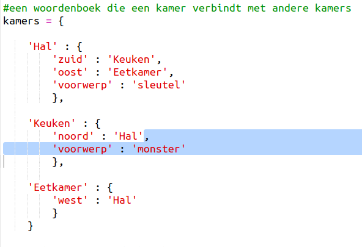
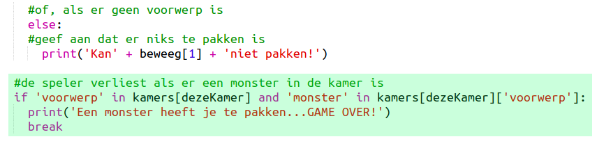
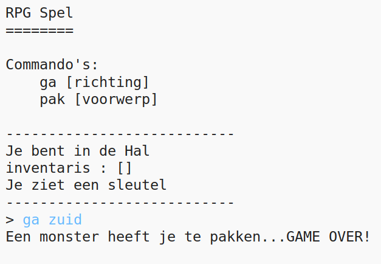

## Vijanden toevoegen

Dit spel is te makkelijk! We gaan vijanden in een paar kamers toevoegen die de speler moet zien te vermijden.

+ Het toevoegen van een vijand in een kamer is net zo makkelijk als het toevoegen van een voorwerp. We voegen een hongerig monster toe aan de keuken:
    
    

+ Je wilt ook zeker weten dat het spel eindigt als de speler een kamer met een monster binnenkomt. Dit kun je doen door de volgende code aan het einde van je spel te zetten:
    
    
    
    Deze code bekijkt of er een voorwerp in de kamer is en zo ja, of het een monster is. Let er op dat de code inspringt zodat het gelijk staat met de code erboven. Elke keer dat de speler naar een andere kamer gaat, controleert het spel of er een monster is.

+ Probeer het uit door naar de keuken te gaan, waar nu een monster zit.
    
    