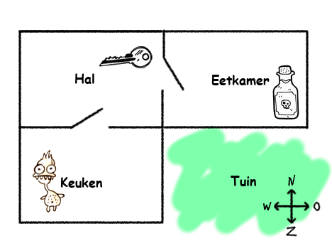
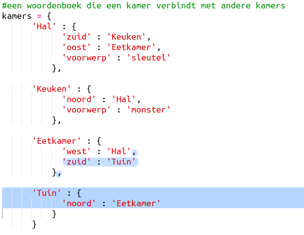
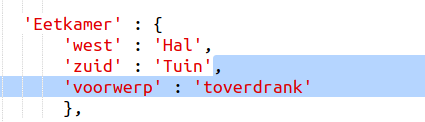
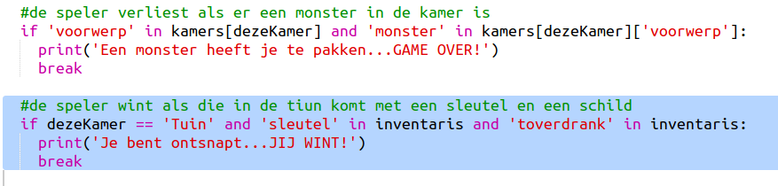
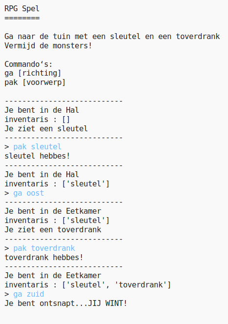
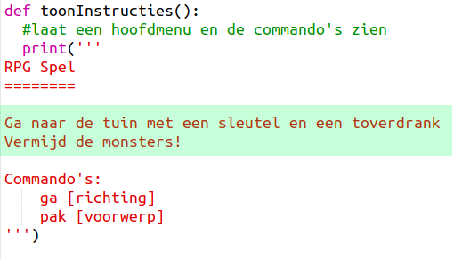
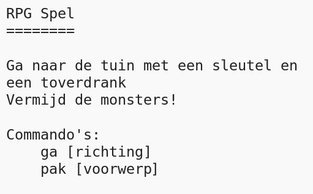

## Het spel winnen

We gaan de speler een doel geven wat gehaald moet worden om het spel te kunnen winnen.

+ In dit spel wint de speler als die in de tuin komt en zo uit het huis ontsnapt. De sleutel en de toverdrank moet ook zijn gepakt. Hier is een kaart van het spel.
    
    

+ Ten eerste moet er een tuin worden gemaakt, ten zuiden van de eetkamer. Vergeet niet om deuren toe te voegen voor de verbinding met andere kamers in het huis.
    
    

+ Plaats een toverdrank in de eetkamer (of een andere kamer in je huis).
    
    

+ Voeg deze code toe om ervoor te zorgen dat de speler wint als die in de tuin aankomt met sleutel en toverdrank:
    
    
    
    Zorg ervoor dat de code inspringt zodat het gelijk staat met de code erboven. Deze code zorgt ervoor dat het bericht `Je bent ontsnapt...JIJ WINT!` wordt getoond als de speler in kamer 4 is (de tuin) en de sleutel en de toverdrank in de inventaris zit.
    
    Als je meer dan 4 kamers hebt kan het zijn dat je in de code hierboven een ander kamernummer moet gebruiken voor de tuin.

+ Test het spel en zorg ervoor dat de speler kan winnen!
    
    

+ Tot slot voegen we wat instructies toe aan het spel zodat de speler weet wat die moet doen. Bewerk de functie `toonInstructies()` om meer informatie te geven.
    
    
    
    Je moet instructies toevoegen om de speler te vertellen welke voorwerpen ze moeten verzamelen en wat ze moeten zien te vermijden!

+ Test het spel en kijk of de instructies zichtbaar zijn.
    
    