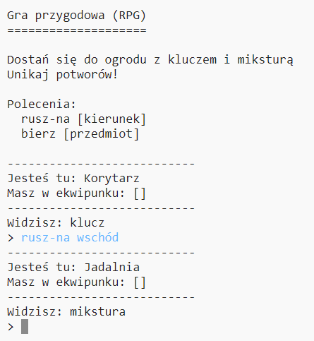

## Wprowadzenie:

W tym projekcie zaprojektujesz i zaprogramujesz własną labiryntową grę RPG. Celem gry będzie zbieranie przedmiotów i ucieczka z domu, unikając wszystkich potworów!

## Co zrobisz

\--- no-print \---

Wpisz `ruszaj-na` a następnie nazwę kierunku (północ, wschód, południe lub zachód) aby poruszać się po świecie (np. `ruszaj-na północ`).

Wpisz `bierz` i nazwę przedmiotu, który widzisz (np. `bierz klucz`).

  <iframe src="https://trinket.io/embed/python/d06adeb527?outputOnly=true&start=result" width="600" height="500" frameborder="0" marginwidth="0" marginheight="0" allowfullscreen>
  </iframe>
  

\--- /no-print \---

\--- print-only \---

\--- /print-only \---

## \--- collapse \---

## title: Czego będziesz potrzebować

### Sprzęt

+ Komputer, na którym można uruchomić Python

### Oprogramowanie

+ Python 3 ([online](https://trinket.io/){:target="_blank"} lub [offline](https://www.python.org/downloads/){:target="_blank"})

### Pliki do pobrania

Projekt początkowy można znaleźć [tutaj](http://rpf.io/p/en/rpg-go){:target="_blank"}.

\--- /collapse \---

## \--- collapse \---

## title: Czego się nauczysz

+ Projekt gry;
+ Edycja: 
    + Listy;
    + Słowniki.
+ Wyrażenia logiczne.

Ten projekt obejmuje elementy z następujących wątków [Programu nauczania Raspberry Pi Digital Making](http://rpf.io/curriculum):

+ [Połącz konstrukcje programistyczne, aby rozwiązać problem.](https://www.raspberrypi.org/curriculum/programming/builder)

\--- /collapse \---

## \--- collapse \---

## title: Dodatkowe informacje dla nauczycieli

Jeśli chcesz wydrukować ten projekt, skorzystaj z [wersji do druku](https://projects.raspberrypi.org/en/projects/rpg/print).

Możesz znaleźć [kompletną wersję projektu tutaj](http://rpf.io/p/en/rpg-get){:target="_blank"}.

\--- /collapse \---