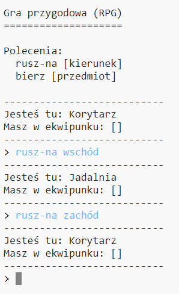

## Dodawanie nowych pokoi

--- task ---

Otwórz projekt startowy Python.

**Online**: otwórz projekt startowy w [trinket.io/python/f9575c0b0f](https://trinket.io/python/f9575c0b0f){:target="_blank"}.

**Offline**: otwórz [projekt startowy](https://rpf.io/p/pl-PL/rpg-go){:target="_blank"} w edytorze offline.

--- /task ---

--- task ---

To jest bardzo prosta gra RPG, która ma tylko 2 pokoje. Oto mapa gry:

Możesz wpisać `rusz-na południe` aby przejść z korytarza do kuchni, a potem `rusz-na północ` aby wrócić z powrotem do korytarza!

--- /task ---

--- task ---

Co się wydarzy, kiedy wpiszesz kierunek, w który nie da się pójść? Wpisz w korytarzu `rusz-na zachód` a dostaniesz komunikat o błędzie.

--- /task ---

--- task ---

Jeśli odnajdziesz zmienną `pokoje`, zobaczysz że mapa jest zakodowana jako słownik pokojów:

--- code ---
---
language: python
---
# słownik łączący pokój z innymi pokojami

pokoje = {

            'Korytarz' : {
                'południe' : 'Kuchnia'
            },
    
            'Kuchnia' : {
                'północ' : 'Korytarz'
            }
    
        }
    

--- /code ---

Każdy pokój jest słownikiem, a pokoje są połączone ze sobą za pomocą kierunków.

--- /task ---

--- task ---

Dodajmy jadalnię do mapy, na wschód od korytarza.

Musisz dodać trzeci pokój nazwany `jadalnia` i połączyć go z korytarzem (na zachodzie). Musisz również dodać dane do korytarza, abyś mógł z niego się przedostać do jadalni idąc na wschód.

**Nie zapomnij o przecinkach w liniach przed dodawanym kodem.**

--- code ---
---
language: python
line_highlights: 5-6,11-15
---

# słownik łączący pokój z innymi pokojami

pokoje = {

            'Korytarz' : {
                'południe' : 'Kuchnia',
                'wschód' : 'Jadalnia'
            },
    
            'Kuchnia' : {
                'północ' : 'Korytarz'
            },
    
            'Jadalnia' : {
                'zachód' : 'Korytarz'
            }
    
        }
    

--- /code ---

--- /task ---

--- task ---

Wypróbuj nową wersję gry z jadalnią:

Jeśli nie możesz się dostać do albo wydostać z jadalni, sprawdź czy dodałeś cały kod jak powyżej (łącznie z dodatkowymi przecinkami w poprzednich liniach).

--- /task ---
