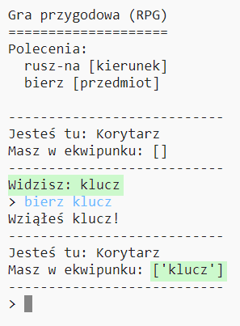

## Dodawanie przedmiotów do zebrania

Zostawmy przedmioty w pokojach, aby gracz mógł je zbierać, gdy przechodzi przez "labirynt".

\--- task \--- Dodanie przedmiotu do pokoju jest proste, wystarczy dodać go do słownika pokoju. Pozostawmy klucz w korytarzu.

Pamiętaj, aby dodać przecinek za linia ponad nowym przedmiotem, bo inaczej Twój program się nie uruchomi!

## \--- code \---

language: python

## line_highlights: 6-7

# słownik łączący pokój z innymi pokojami

rooms = {

            'Korytarz' : {
                'południe' : 'Kuchnia',
                'wschód' : 'Jadalnia'
            },
    
            'Kuchnia' : {
                'północ' : 'Korytarz'
            },
    
            'Jadalnia' : {
                'zachód' : 'Korytarz'
            }
    
        }
    

\--- /code \---

\--- /task \---

\--- task \--- Kiedy uruchomisz grę po dodaniu powyższego kodu, będziesz mógł zobaczyć klucz w korytarzu i możesz go nawet wziąć (pisząc `bierz klucz`), co doda go do ekwipunku gracza!

 \--- /task \---