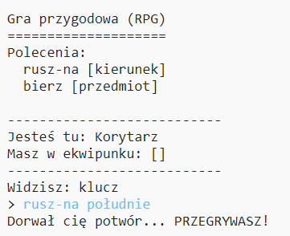

## Dodawanie wrogów

Ta gra jest zbyt łatwa! Dodajmy wrogów do niektórych pomieszczeń, których gracz musi unikać.

\--- task \--- Dodanie przeciwnika do pokoju jest tak samo łatwe jak dodawanie przedmiotu. Dodajmy głodnego potwora do kuchni:

## \--- code \---

language: python

## line_highlights: 11-12

# słownik łączący pokój z innymi pokojami

rooms = {

            'Korytarz' : {
                'południe' : 'Kuchnia',
                'wschód' : 'Jadalnia',
                'item' : 'klucz'
            },
    
            'Kuchnia' : {
                'północ' : 'Korytarz',
                'item' : 'potwór'        },
    
            'Jadalnia' : {
                'zachód' : 'Korytarz'
            }
    
        }
    

\--- /code \--- \--- /task \---

\--- task \--- Chcemy również być pewni, że gra się skończy przegraną jeśli gracz wejdzie do pokoju, w którym jest potwór. Aby to osiągnąć, dodaj taki kod na końcu swojej gry:

## \--- code \---

language: python

## line_highlights: 6-9

        #w przeciwnym wypadku, jeśli przedmiotu nie można wziąć bo go nie ma
        else:
            #powiedz, że nie da się tego wziąć
            print('Tego nie możesz wziąć: ' + move[1] + '!')
    
    #gracz przegrywa jeśli wejdzie do pokoju z potworem
    if 'item' in rooms[currentRoom] and 'potwór' in rooms[currentRoom]['item']:
        print('Dorwał cię potwór... PRZEGRYWASZ!')
        break
    

\--- /code \---

Ten kod sprawdza, czy w pokoju jest jakaś rzecz, a jeśli tak, to czy jest to potwór. Zauważ, że ten kod ma wcięcie, dzięki czemu pasuje do kodu nad nim. Oznacza to, że gra będzie sprawdzać obecność potwora za każdym razem, gdy gracz przejdzie do nowego pokoju. \--- /task \---

\--- task \--- Przetestuj swój program, wchodząc do kuchni, która zawiera teraz potwora.

 \--- /task \---