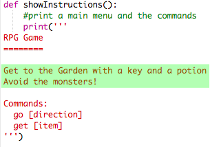

## Wygrywając grę

Dajmy graczowi misję, która musi zostać ukończona, aby wygrać mecz.

+ W tej grze gracz wygrywa, przechodząc do ogrodu i uciekając z domu. Muszą także mieć klucz z nimi i magiczną miksturę. Oto mapa gry.
    
    

+ Najpierw musisz dodać ogród na południe od jadalni. Pamiętaj, aby dodać drzwi, aby linkować do innych pomieszczeń w domu.
    
    

+ Dodaj miksturę do jadalni (lub innego pokoju w twoim domu).
    
    

+ Dodaj ten kod, aby pozwolić graczowi wygrać grę, gdy dostaną się do ogrodu za pomocą klucza i mikstury:
    
    
    
    Upewnij się, że ten kod jest wcięty, zgodnie z kodem znajdującym się nad nim. Ten kod oznacza, że ​​wiadomość `Uciekłeś z domu ... WYGRAJ!` jest wyświetlany, jeśli gracz znajduje się w pokoju 4 (ogród) i jeśli klucz i mikstura znajdują się w ekwipunku.
    
    Jeśli masz więcej niż 4 pokoje, możesz użyć innego numeru pokoju w swoim ogrodzie w powyższym kodzie.

+ Sprawdź swoją grę, aby upewnić się, że gracz może wygrać!
    
    

+ Na koniec dodajmy kilka instrukcji do twojej gry, aby gracz wiedział, co mają robić. Edytuj funkcję `showInstructions ()` , aby dodać więcej informacji.
    
    
    
    Będziesz musiał dodać instrukcje, aby poinformować użytkownika, jakie przedmioty należy zebrać i czego unikać!

+ Przetestuj swoją grę i powinieneś zobaczyć swoje nowe instrukcje.
    
    