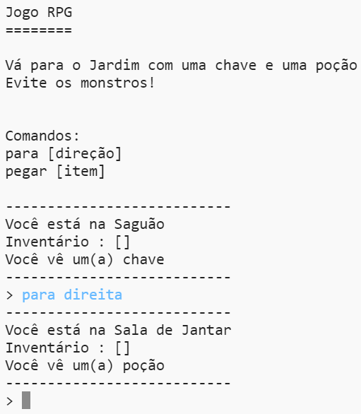

## Introdução:

Neste projeto, você irá desenvolver e programar o seu próprio jogo de labirinto de RPG. O objetivo do jogo será coletar objetos e escapar de uma casa, evitando todos os monstros!

## O que você vai fazer

\--- no-print \---

Digite `para` e uma direção (cima, direita, baiixo, esquerda) para se mover pelo mapa (Ex.: `para cima`).

Digite `pegar` para pegar qualquer item que você encontrar (Ex.: `pegar chave`).

  <iframe src="https://trinket.io/embed/python/d06adeb527?outputOnly=true&start=result" width="600" height="500" frameborder="0" marginwidth="0" marginheight="0" allowfullscreen>
  </iframe>
  

\--- /no-print \---

\--- print-only \---

\--- /print-only \---

## \--- collapse \---

## title: O que você vai precisar

### Hardware

+ Um computador capaz de executar Python

### Software

+ Python 3 ([online](https://trinket.io/){:target="_ blank"} ou [offline](https://www.python.org/downloads/){:target="_ blank"})

### Downloads

O projeto inicial pode ser encontrado [aqui](http://rpf.io/p/en/rpg-go){:target="_blank"}.

\--- /collapse \---

## \--- collapse \---

## title: O que você vai aprender

+ Design de jogo;
+ Edição: 
    + Listas;
    + Dicionários.
+ Expressões booleanas.

Este projeto abrange elementos das seguintes vertentes do [Currículo de Criação Digital Raspberry Pi](http://rpf.io/curriculum):

+ [Combine estruturas de programação para resolver um problema.](https://www.raspberrypi.org/curriculum/programming/builder)

\--- /collapse \---

## \--- collapse \---

## informações adicionais para educadores

Se você precisar imprimir este projeto, use a [versão para impressão](https://projects.raspberrypi.org/en/projects/rpg/print).

Você pode [encontrar as soluções para este projeto aqui](http://rpf.io/p/en/rpg-get){:target="_blank"}.

\--- /collapse \---