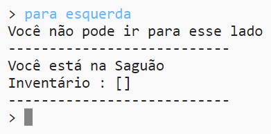

## Adicionando novos quartos

+ Algum código para este jogo foi fornecido para você. Open this trinket: <a href="http://jumpto.cc/rpg-go" target="_blank">jumpto.cc/rpg-go</a>.

+ Este é um jogo de RPG muito básico que só tem 2 quartos. Aqui está um mapa do jogo:
    
    
    
    Você pode digitar `ir para o sul` para ir do corredor até a cozinha e, em seguida, `ir para o norte` para voltar ao salão novamente!
    
    

+ O que acontece quando você digita uma direção que você não pode ir? Digite `, vá para o oeste` no corredor e você receberá uma mensagem de erro amigável.
    
    

+ Se você encontrar a variável `quartos` , poderá ver que o mapa está codificado como um dicionário de salas:
    
    
    
    Cada sala é um dicionário e as salas são ligadas entre si usando as direções.

+ Vamos adicionar uma sala de jantar ao seu mapa, a leste do salão.
    
    
    
    Você precisa adicionar um terceiro quarto, chamado `sala de jantar`. Você também precisa vinculá-lo ao salão a oeste. Você também precisa adicionar dados ao salão, para que você possa ir para a sala de jantar a leste.
    
    

+ Experimente o jogo com sua nova sala de jantar:
    
    
    
    Se você não pode entrar e sair da sala de jantar, basta verificar que você adicionou todo o código acima (incluindo as vírgulas extras para as linhas acima).