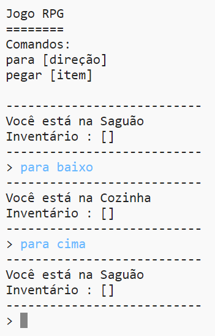

## Adicionar novos cômodos

\--- task \--- Abra o projeto inicial.

**Online**: abra o projeto inicial em [rpf.io/rpgon](http://rpf.io/rpgon){:target="_blank"}.

**Off-line**: abra o [projeto inicial](http://rpf.io/p/en/rpg-go){:target="_ blank"} no editor offline. \--- /task \---

\--- task \--- Este é um jogo RPG básico com apenas 2 cômodos. Aqui está um mapa do jogo:

Você pode digitar `sul` para ir do corredor até a cozinha e, em seguida, `norte` para voltar ao salão novamente!

 \--- /task \---

\--- task \--- O que acontece quando você digita uma direção que você não pode ir? Digite `oeste` no corredor e você receberá uma mensagem de erro.

 \--- /task \---

\--- task \--- Se você encontrar a variável `cômodos`, poderá ver que o mapa está codificado como um dicionário de salas:

## \--- code \---

## language: python

# um dicionário ligando um cômodo aos outros cômodos

comodos= {

            'Saguão' : {
                'sul' : 'Cozinha'
            },
    
            'Cozinha' : {
                'norte' : 'Saguão'
            }
    
        }
    

\--- /code \---

Cada cômodo é um dicionário e os cômodos são ligados entre si usando as direções.  
\--- /task \---

\--- task \--- Vamos adicionar uma sala de jantar ao seu mapa, a leste do saguão.

Você precisa adicionar um terceira cômodo, chamado de `sala de jantar`, e ligá-la ao saguão (oeste). Você também vai precisa adicionar dados ao salão, para que você possa ir para a sala de jantar à leste.

**Não esqueça que você também vai precisar adicionar vírgulas nas linhas anteriores ao novo código.**

## \--- code \---

language: python

## line_highlights: 5-6,11-15

# um dicionário ligando um cômodo aos demais cômodos

comodos= {

            'Saguão' : {
                'sul' : 'Cozinha',
                'leste' : 'Sala de Jantar'
            },
    
            'Cozinha' : {
                'norte' : 'Saguão'
            },
    
            'Sala de Jantar' : {
                'oeste' : 'Saguão'
            }
    
        }
    

\--- /code \--- \--- /task \---

\--- task \--- Teste o jogo com a sua nova sala de jantar:

Se você não puder entrar e sair da sala de jantar, basta verificar se você adicionou todo o código acima (incluindo as vírgulas extras para as linhas acima). \--- /task \---