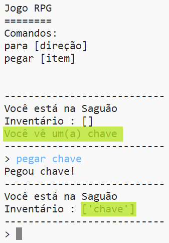

## Adicionando itens para coletar

Vamos deixar itens nos cômodos para o jogador coletar enquanto eles se movem pelo labirinto.

\--- task \--- Adicionar um item a um cômodo é fácil, basta adicioná-lo ao dicionário do respectivo cômodo. Vamos colocar uma chave no saguão.

Lembre-se de colocar uma vírgula ao final da linha anterior, ou seu programa não será executado!

## \--- code \---

language: python

## line_highlights: 6-7

# um dicionário ligando um cômodo aos demais cômodos

comodos= {

            'Saguao' : {
                'sul' : 'Cozinha',
                'leste' : 'Sala Jantar',
                'item' : 'chave'
            },
    
            'Cozinha' : {
                'norte' : 'Saguão'
            },
    
            'Sala Jantar' : {
                'oeste' : 'Saguão'
            }
    
        }
    

\--- /code \---

\--- /task \---

\--- task \--- Se você executar o seu jogo depois de adicionar o código acima, você verá uma chave no saguão e poderá pegá-la (digitando `pegar chave`), que a adiciona ao seu inventário!

 \--- /task \---