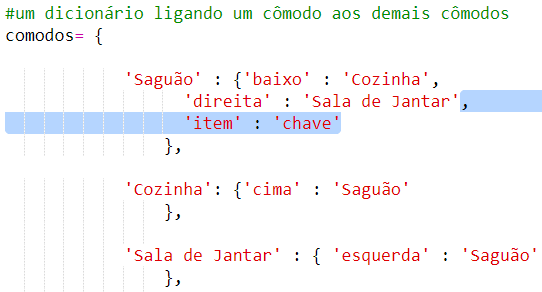

## Adicionando itens para coletar

Vamos deixar itens nos quartos para o jogador coletar enquanto eles se movem pelo labirinto.

+ Adicionar um item a uma sala é fácil, basta adicioná-lo ao dicionário da sala. Vamos colocar uma chave no corredor.
    
    
    
    Lembre-se de colocar uma vírgula após a linha acima do novo item, ou seu programa não será executado!

+ Se você executar o seu jogo depois de adicionar o código acima, agora você pode ver uma chave no salão, e você pode até mesmo pegá-lo (digitando `obter a chave`), que o adiciona ao seu inventário!
    
    