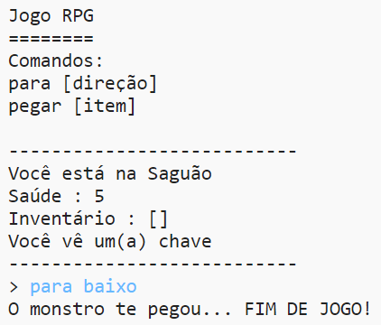

## Adicionando inimigos

Este jogo está muito fácil! Vamos adicionar inimigos em alguns cômodos que o jogador deve evitar.

--- task ---

Adicionar um inimigo a um cômodo é tão fácil quanto adicionar qualquer outro item. Vamos adicionar um monstro faminto à cozinha:

--- code ---
---
language: python
line_highlights: 11-12
---

# um dicionário ligando um cômodo aos demais cômodos

comodos= {

            'Saguao' : {
                'baixo' : 'Cozinha',
                'direita' : 'Sala de Jantar',
                'item' : 'chave'
            },
    
            'Cozinha' : {
                'cima' : 'Saguão',
                'item' : 'monstro'
            },
    
            'Sala de Jantar' : {
                'esquerda' : 'Saguão'
            }
    
        }
    

--- /code ---

--- /task ---

--- task ---

Você também quer ter certeza de que o jogo vai acabar se o jogador entrar em uma sala com um monstro. Você pode fazer isso com o seguinte código, que você deve adicionar ao final do jogo:

--- code ---
---
language: python
line_highlights: 6-9
---
        #se nāo houver item para coletar
        else:
            #fale para o jogador que ele não pode pegar
            print('Não pode pegar o(a) ' + movimento[1] + '!')
    
    #o jogador perde se entrar em um cômodo com um monstro
    if "item" in comodos[comodoAtual] and 'monstro' in comodos[comodoAtual]['item']:
        print('O monstro te pegou... FIM DE JOGO!')
        break
    

--- /code ---

Este código verifica se existe um item na sala e, em caso afirmativo, se esse item é um monstro. Observe que esse código é recuado, colocando-o de acordo com o código acima dele. Isto significa que o jogo irá procurar por um monstro toda vez que o jogador se mudar para uma nova sala.

--- /task ---

--- task ---

Teste seu código indo até a cozinha, que agora contém um monstro.

--- /task ---